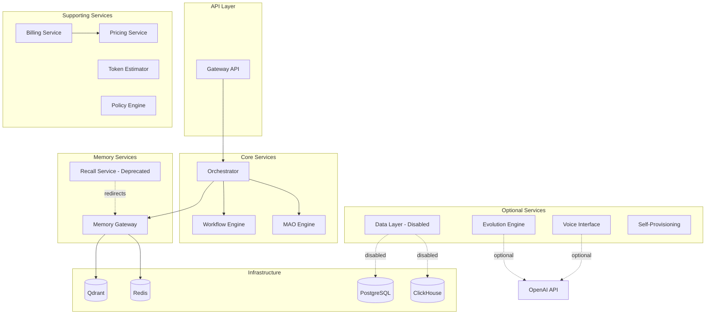
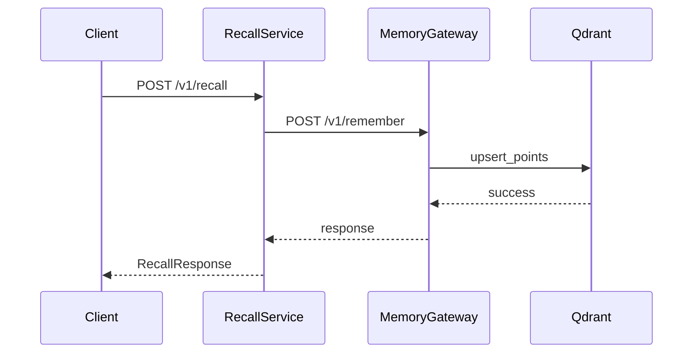
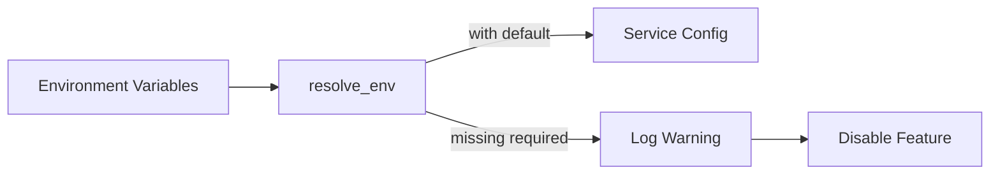
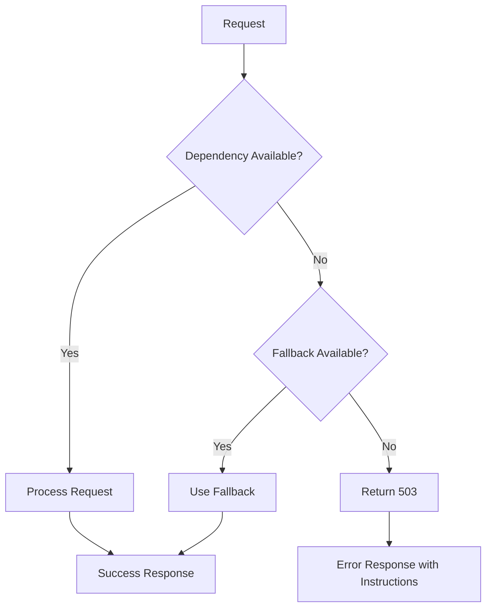

# Design Document: Production Refactoring

## Overview

This design document describes the technical approach for refactoring SomaAgentHub to production-level quality. The refactoring consolidates overlapping services, removes placeholder code, standardizes patterns across services, and ensures all code follows Vibe Coding Rules.

The refactoring focuses on:
1. Service consolidation (memory-gateway absorbs recall-service)
2. Configuration standardization using `resolve_env`
3. Health check and metrics standardization
4. Graceful degradation for optional services
5. Security improvements (no hardcoded secrets)

## Architecture

### Current Service Architecture



### Service Consolidation Pattern

The recall-service is deprecated and redirects all requests to memory-gateway:



### Configuration Flow

All services use the common `resolve_env` function for configuration:



## Components and Interfaces

### Common Modules

#### `services/common/config/base_settings.py`
- `resolve_env(key: str, default: str = "") -> str`: Load environment variable with optional default
- Used by all services for consistent configuration loading

#### `services/common/redis_client.py`
- `get_redis_client() -> AsyncRedisClient`: Factory for Redis connections
- `AsyncRedisClient.health_check() -> bool`: Check Redis availability

#### `services/common/qdrant_client.py`
- `get_qdrant_client() -> QdrantClient`: Factory for Qdrant connections
- `QdrantClient.health_check() -> bool`: Check Qdrant availability
- `QdrantClient.upsert_points(collection_name, points)`: Store vectors
- `QdrantClient.search(collection_name, query_vector, limit)`: Vector search

#### `services/common/audit_logger.py`
- `audit_log(event_type, actor_id, resource_type, ...)`: Structured audit logging
- `AuditEventType`: Enum of audit event types
- `AuditSeverity`: Enum of severity levels

### Memory Gateway Service

**Endpoints:**
| Endpoint | Method | Description |
|----------|--------|-------------|
| `/v1/remember` | POST | Store memory with vector embedding |
| `/v1/recall/{key}` | GET | Retrieve memory by key |
| `/v1/memories` | GET | List all memory keys |
| `/v1/rag/retrieve` | POST | RAG retrieval with vector search |
| `/v1/capsule/results` | POST | Store capsule execution results |
| `/health` | GET | Simple health check |
| `/healthz` | GET | Detailed health with dependencies |
| `/metrics` | GET | Prometheus metrics |

**Graceful Degradation:**
- If Qdrant unavailable: Falls back to in-memory store
- If LLM Hub unavailable: Uses zero vector for embeddings
- If Redis unavailable: Reports in health check, continues operation

### Recall Service (Deprecated)

**Behavior:**
- All endpoints forward to memory-gateway via HTTP
- Returns deprecation notice in root endpoint
- Maintains backward compatibility for existing clients

### Optional Services Pattern

Services that require external dependencies (OpenAI, Terraform) follow this pattern:

```python
# Configuration
API_KEY = resolve_env("OPENAI_API_KEY", "")
SERVICE_ENABLED = bool(API_KEY)

# Lazy client initialization
_client = None

def get_client():
    global _client
    if _client is None:
        if not API_KEY:
            raise HTTPException(status_code=503, detail="Service disabled: API key not configured")
        _client = OpenAI(api_key=API_KEY)
    return _client

# Health check reports status
@app.get("/health")
def health():
    return {"status": "healthy" if SERVICE_ENABLED else "degraded", "enabled": SERVICE_ENABLED}
```

## Data Models

### Memory Gateway Models

```python
class RememberRequest(BaseModel):
    key: str = Field(..., description="Identifier for the memory entry")
    value: Any = Field(..., description="Arbitrary JSON-serializable value")

class RecallResponse(BaseModel):
    key: str
    value: Any

class RAGRequest(BaseModel):
    query: str = Field(..., description="Search query for RAG")

class RAGResponse(BaseModel):
    answer: str
    sources: list[str] = []
```

### Billing Service Models

```python
class PaymentIntentRequest(BaseModel):
    user_id: str = Field(..., description="ID of user")
    amount_cents: int = Field(..., ge=1, description="Amount in cents")
    currency: str = Field("usd", description="3 letter currency code")
    description: str | None = Field(None)

class PaymentIntentResponse(BaseModel):
    intent_id: str
    client_secret: str | None
    amount_cents: int
    currency: str
    created_at: datetime
```

### Evolution Engine Models

```python
class ExecutionTelemetry(BaseModel):
    capsule_id: str
    execution_id: str
    success: bool
    duration_seconds: float
    error_message: str | None = None
    context: dict[str, Any] = Field(default_factory=dict)
    timestamp: datetime

class ImprovementSuggestion(BaseModel):
    capsule_id: str
    type: str  # 'optimization', 'error_handling', 'new_feature', 'refactoring'
    description: str
    rationale: str
    implementation_hints: list[str]
    confidence: float  # 0.0-1.0
    impact: str  # 'low', 'medium', 'high'
```


## Correctness Properties

*A property is a characteristic or behavior that should hold true across all valid executions of a system-essentially, a formal statement about what the system should do. Properties serve as the bridge between human-readable specifications and machine-verifiable correctness guarantees.*

Based on the acceptance criteria analysis, the following correctness properties have been identified:

### Property 1: Memory Round-Trip Consistency

*For any* valid key-value pair stored via `/v1/remember`, retrieving it via `/v1/recall/{key}` SHALL return the same value that was stored.

**Validates: Requirements 1.2, 1.4**

### Property 2: Health Endpoint Consistency

*For any* service in the SomaAgentHub platform, the `/health` endpoint SHALL return a JSON response containing at minimum a `status` field with value "healthy", "degraded", or "unhealthy", and a `service` field identifying the service name.

**Validates: Requirements 4.1, 4.2**

### Property 3: Detailed Health Check Structure

*For any* service with external dependencies, the `/healthz` endpoint SHALL return a JSON response containing individual status entries for each dependency (e.g., `kv_store`, `vector_store`, `database`).

**Validates: Requirements 4.3**

### Property 4: Prometheus Metrics Format

*For any* service exposing a `/metrics` endpoint, the response SHALL be valid Prometheus text format containing at least one metric line matching the pattern `metric_name{labels} value`.

**Validates: Requirements 4.4**

### Property 5: Graceful Degradation for Optional Services

*For any* optional service (evolution-engine, voice-interface, data-layer, self-provisioning) where the required API key or enable flag is not configured, the service SHALL:
- Return HTTP 503 for endpoints requiring the missing dependency
- Include a `detail` message explaining how to enable the feature
- Report `enabled: false` or `status: degraded` in health checks

**Validates: Requirements 6.1, 6.2, 6.3, 6.4, 6.5**

### Property 6: Configuration Security

*For any* service configuration value that represents a secret (API keys, passwords, tokens), the value SHALL be loaded via `resolve_env()` with an empty string default, and SHALL NOT appear in:
- Health check responses
- Error messages returned to clients
- Default configuration values in code

**Validates: Requirements 3.3, 3.4, 8.2, 8.3**

### Property 7: Error Response Consistency

*For any* HTTP error response from a service:
- Validation errors (invalid input) SHALL return HTTP 422 with field-level error details
- Upstream service failures SHALL return HTTP 502 with service identification
- Service unavailable (missing config) SHALL return HTTP 503 with enablement instructions
- Unexpected errors SHALL return HTTP 500 with generic message (no stack traces)

**Validates: Requirements 9.2, 9.3, 9.4, 9.5**

### Property 8: Service Enable Flag Behavior

*For any* service with a `SERVICE_ENABLED` flag, when the flag is `False`:
- The service SHALL start without errors
- The service SHALL respond to health checks
- Endpoints requiring the disabled feature SHALL return HTTP 503
- The root endpoint SHALL indicate the disabled status

**Validates: Requirements 3.5, 6.5**

## Error Handling

### Error Response Schema

All services use a consistent error response format:

```python
class ErrorResponse(BaseModel):
    detail: str  # Human-readable error message
    error_code: str | None = None  # Machine-readable error code
    field_errors: list[dict] | None = None  # For validation errors
```

### HTTP Status Code Mapping

| Scenario | Status Code | Detail Format |
|----------|-------------|---------------|
| Validation error | 422 | Field-level errors from Pydantic |
| Resource not found | 404 | "Resource {type} not found: {id}" |
| Service disabled | 503 | "Service disabled: {reason}. Set {env_var} to enable." |
| Upstream failure | 502 | "{service} unavailable: {error}" |
| Authentication required | 401 | "Authentication required" |
| Authorization denied | 403 | "Not authorized to {action}" |
| Unexpected error | 500 | "Internal server error" (no details exposed) |

### Graceful Degradation Strategy



## Testing Strategy

### Dual Testing Approach

The refactoring uses both unit tests and property-based tests:

1. **Unit Tests**: Verify specific examples and edge cases
2. **Property-Based Tests**: Verify universal properties across all inputs

### Property-Based Testing Framework

**Framework**: `hypothesis` (Python)

**Configuration**:
```python
from hypothesis import settings, given, strategies as st

@settings(max_examples=100)
@given(...)
def test_property(...):
    ...
```

### Test Categories

#### 1. Health Endpoint Tests
- Verify all services expose `/health` and `/healthz`
- Verify response structure consistency
- Verify dependency status reporting

#### 2. Configuration Tests
- Verify `resolve_env` usage for all secrets
- Verify graceful handling of missing configuration
- Verify no secrets in error responses

#### 3. Error Handling Tests
- Verify correct HTTP status codes
- Verify error message format
- Verify no stack traces in production errors

#### 4. Memory Gateway Tests
- Verify round-trip consistency (store → retrieve)
- Verify fallback to in-memory store
- Verify Prometheus metrics format

#### 5. Service Degradation Tests
- Verify services start without required dependencies
- Verify 503 responses for disabled features
- Verify health check accuracy

### Test File Structure

```
tests/
├── unit/
│   ├── test_memory_gateway.py
│   ├── test_billing_service.py
│   ├── test_evolution_engine.py
│   └── test_common_modules.py
├── property/
│   ├── test_health_endpoints.py      # Property 2, 3
│   ├── test_memory_roundtrip.py      # Property 1
│   ├── test_error_responses.py       # Property 7
│   ├── test_graceful_degradation.py  # Property 5, 8
│   └── test_config_security.py       # Property 6
└── integration/
    ├── test_service_consolidation.py
    └── test_end_to_end.py
```

### Property Test Annotations

Each property-based test must include:
```python
# **Feature: production-refactoring, Property 1: Memory Round-Trip Consistency**
# **Validates: Requirements 1.2, 1.4**
@given(key=st.text(min_size=1), value=st.dictionaries(st.text(), st.text()))
def test_memory_roundtrip(key, value):
    ...
```
