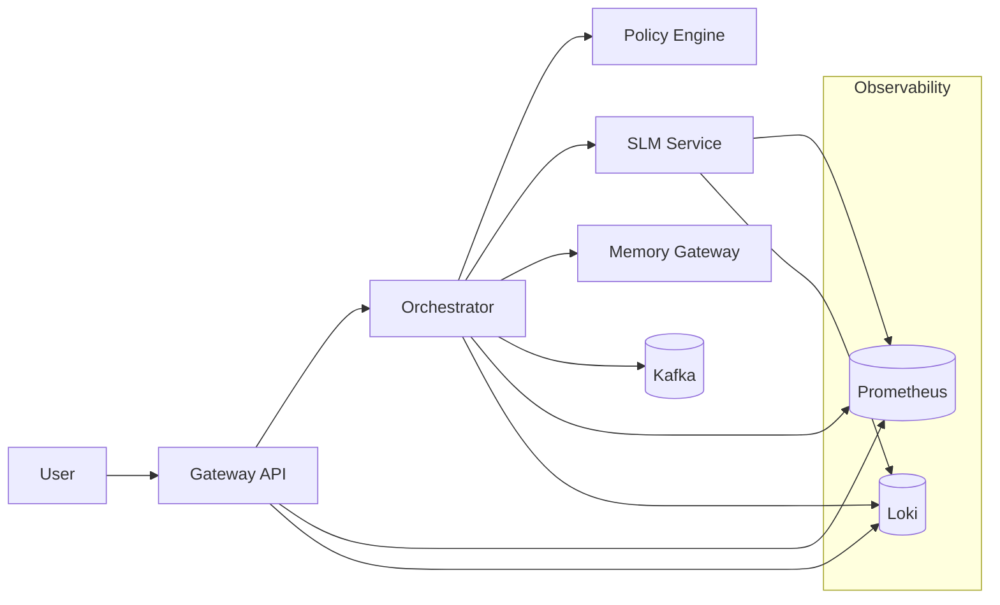
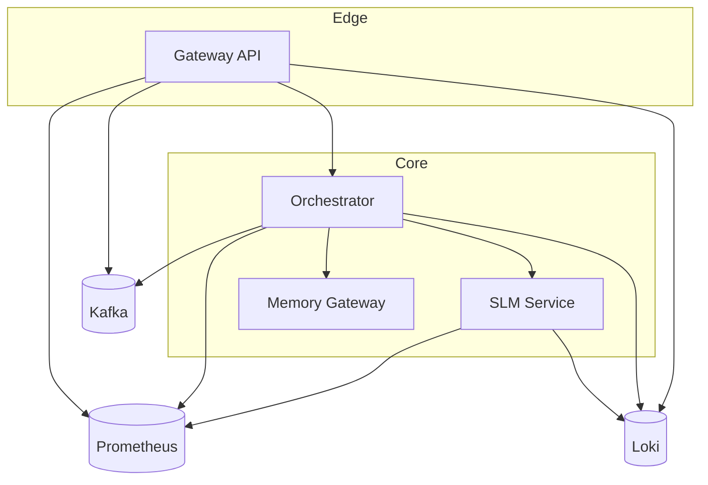

# SomaAgentHub Platform Architecture

> ⚠️ WE DO NOT MOCK, WE DO NOT IMITATE, WE DO NOT USE BYPASSES OR FAKE VALUES. All architecture and flows reflect real, running systems.

Last Updated: October 9, 2025

> This document provides a high-level view of the platform architecture, components, and data flows.

## Namespaces
- `soma-infra`: shared infra (Redis, Kafka; optional Prometheus/Grafana, OPA, Vault, Etcd)
- `soma-agent-hub`: application services (gateway-api, orchestrator, identity-service, policy-engine, slm-service)

## Shared Infra (dev-sized)
- Redis: 1 replica, no persistence, low resources.
- Kafka (KRaft): 1 broker, no persistence, low resources.
- Optional: Prometheus/Grafana, OPA, Vault, Etcd (disabled by default).

DNS:
- `redis.soma-infra.svc.cluster.local:6379`
- `kafka.soma-infra.svc.cluster.local:9092`

## Application Services
- Gateway API (HTTP 8080)
- Orchestrator (HTTP 1004; Temporal disabled by default)
- Identity (Auth) (HTTP 8000)
- Policy Engine (HTTP 8000)
- SLM Service (HTTP 1001)

## Configuration Strategy
- Common BaseSettings in `common/config/settings.py`.
- K8s Secrets for sensitive values; ConfigMaps for non-sensitive.
- Helm values-dev for local; production via separate values.

## Observability
- Common OpenTelemetry helper; OTLP disabled by default.
- Prometheus optional via infra chart; ServiceMonitor toggles in app chart.

## Deploy (dev)
1. Install infra (dev profile):
   - namespace: soma-infra
2. Install apps (dev profile):
   - namespace: soma-agent-hub
3. Validate `/health` endpoints of gateway, identity, orchestrator, slm.

## Component Responsibilities

- **Gateway API**: The primary entry point for all external traffic. It is responsible for:
    - **Authentication:** Enforcing JWT-based authentication for all protected routes.
    - **Request Routing:** Directing incoming requests to the appropriate downstream service.
    - **Wizards:** Manages interactive, multi-step user workflows through its wizard engine.

- **Orchestrator**: The brain of the platform. It manages complex workflows using Temporal. It can:
    - **Decompose Tasks:** Break down high-level goals into smaller, executable tasks.
    - **Plan Execution:** Create detailed plans for task execution.
    - **Delegate:** Assign tasks to specialized agent frameworks like AutoGen, CrewAI, and LangGraph.

- **Policy Engine**: The guardian of the platform. It provides centralized authorization and policy enforcement.
    - **OPA-style Policies:** Uses a rules engine to evaluate requests against a defined "constitution."
    - **Caching:** Caches policy decisions in Redis to improve performance.

- **Identity Service**: The gatekeeper of the platform. It manages user identities and issues authentication tokens.
    - **JWT Issuance:** Creates and signs JWTs for authenticated users.
    - **Key Rotation:** Automatically rotates signing keys for enhanced security.
    - **Redis Storage:** Uses Redis to store identity information.

- **SLM Service**: The language engine of the platform. It provides deterministic, local language capabilities.
    - **Text Generation:** Generates text using a local model.
    - **Embeddings:** Creates vector embeddings for text.

- **Memory Gateway**: The memory of the platform. It provides long-term storage and retrieval for agent memories.
    - **Vector Storage:** Stores and retrieves vector embeddings for RAG.

- **Kafka**: The nervous system of the platform. It provides a high-throughput, low-latency message bus for asynchronous communication between services.

- **Prometheus/Loki**: The eyes and ears of the platform. They provide a comprehensive observability stack.
    - **Prometheus:** Collects and stores metrics from all services.
    - **Loki:** Collects and stores logs from all services.

- **Temporal**: The backbone of the platform. It provides a durable, reliable, and scalable workflow engine.

## Deployment Topology (Helm + K8s)

- Each service is templated via Helm with standard labels.
- Gateway is NodePort (default 30080 → 8080) for local, can be ClusterIP/Ingr ess in production.
- slm-service is ClusterIP on port 1001.
- Observability stack deployed in observability namespace (optional).

## Diagrams

### System Overview

### Data Flow

