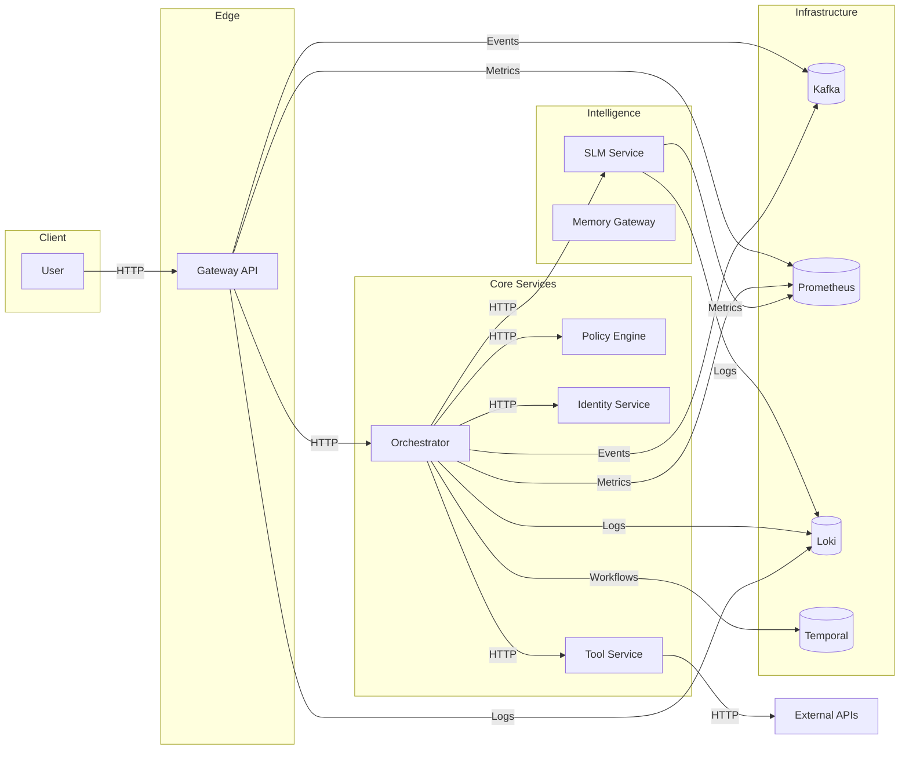
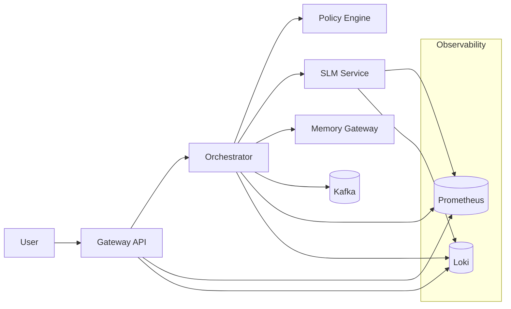
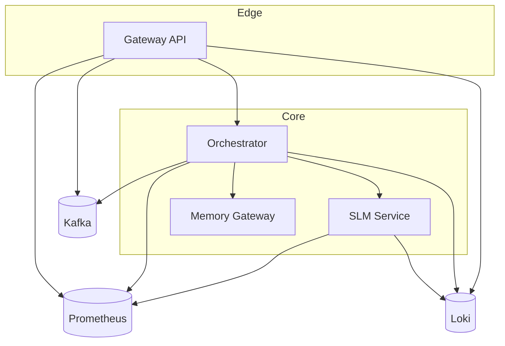

# SomaAgentHub Platform Architecture

> ⚠️ WE DO NOT MOCK, WE DO NOT IMITATE, WE DO NOT USE BYPASSES OR FAKE VALUES. All architecture and flows reflect real, running systems.

Last Updated: October 9, 2025

> This document provides a high-level view of the platform architecture, components, and data flows.

## Component Responsibilities

- Gateway API: Edge entrypoint, auth enforcement, routing
- Orchestrator: Workflow coordination, policy checks, and task execution
- Policy Engine: Authorization decisions and policy evaluation
- Identity Service: Token issuing and user identity verification
- SLM Service: Deterministic local language capabilities
- Memory Gateway: Vector storage / RAG
- Kafka: Event streaming backbone (KRaft mode)
- Prometheus/Loki: Observability stack
- Temporal: Durable workflow orchestration

## Deployment Topology (Helm + K8s)

- Each service is templated via Helm with standard labels.
- Gateway is NodePort (default 30080 → 8080) for local, can be ClusterIP/Ingr ess in production.
- slm-service is ClusterIP on port 1001.
- Observability stack deployed in observability namespace (optional).

## Diagrams

### System Overview

### Data Flow

