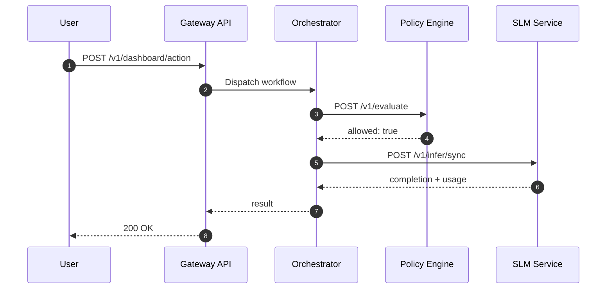

# SLM Strategy

> ⚠️ WE DO NOT MOCK, WE DO NOT IMITATE, WE DO NOT USE BYPASSES OR FAKE VALUES. This document describes the real SLM approach in this repository.

Last Updated: October 9, 2025

## Goals
- Deterministic, local language capabilities for reliable demos and tests
- Simple, observable API surface

## API Endpoints
- GET /health → {"status":"healthy","service":"slm-service"}
- GET /metrics → Prometheus metrics
- POST /v1/infer/sync → text generation
- POST /v1/embeddings → vector embeddings

## Metrics
- slm_infer_sync_requests_total
- slm_infer_sync_latency_seconds
- slm_embedding_requests_total
- slm_embedding_latency_seconds

## Sequence (example)

