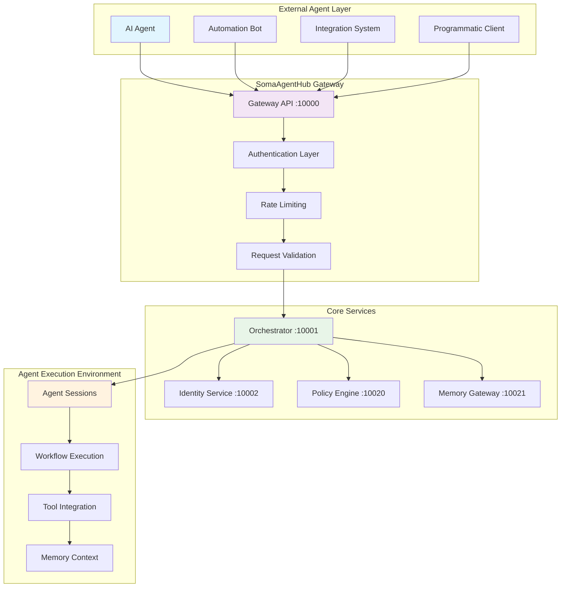

# Agent Onboarding Manual


**Complete guide for AI agents, automation systems, and programmatic integrations**

> Designed specifically for autonomous agents and automated systems that need to understand, integrate with, and operate within the SomaAgentHub ecosystem.

---

## 📋 Overview

This Agent Onboarding Manual provides comprehensive guidance for **AI agents, automation bots, and programmatic systems** that need to interact with SomaAgentHub. Unlike human-focused documentation, this guide is structured for machine-readable understanding and automated integration.

### Target Audience

- **AI Agents** - Large Language Models and autonomous AI systems
- **Automation Bots** - CI/CD systems, monitoring bots, deployment automation
- **Integration Systems** - External platforms connecting to SomaAgentHub
- **Programmatic Clients** - Scripts and applications using SomaAgentHub APIs

---

## 🤖 Agent Integration Architecture



---

## 📚 Agent Onboarding Contents

| Section | Purpose | Integration Level |
|---------|---------|-------------------|
| [Agent Zero](agent-zero.md) | Basic agent setup and first API call | Beginner |
| [Propagation Agent](propagation-agent.md) | Data propagation and event handling | Intermediate |
| [Monitoring Agent](monitoring-agent.md) | System monitoring and alerting | Intermediate |
| [Security Hardening](security-hardening.md) | Security best practices for agents | Advanced |

### Quick Reference for Agents

- **[API Endpoints Reference](#api-endpoints-reference)** - Complete API documentation
- **[Authentication Patterns](#authentication-patterns)** - Token management for agents
- **[Error Handling Patterns](#error-handling-patterns)** - Robust error handling strategies
- **[Rate Limiting Guidelines](#rate-limiting-guidelines)** - Avoiding throttling and blocks
- **[Monitoring Integration](#monitoring-integration)** - Health checks and metrics
- **[Security Compliance](#security-compliance)** - Security requirements for agents

---

## 🚀 Quick Start for Agents (5 Minutes)

### 1. Agent Authentication Setup

**Obtain API Credentials:**
```bash
# For automated systems - use service account
curl -X POST "http://localhost:10002/v1/tokens/service" \
  -H "Content-Type: application/json" \
  -d '{
    "service_name": "my-automation-agent",
    "scopes": ["agent:execute", "session:create", "memory:read"]
  }'
```

**Response:**
```json
{
  "access_token": "eyJhbGciOiJIUzI1NiIsInR5cCI6IkpXVCJ9...",
  "token_type": "bearer",
  "expires_in": 86400,
  "scopes": ["agent:execute", "session:create", "memory:read"]
}
```

### 2. First Agent API Call

**Health Check:**
```bash
# Verify system availability
curl -H "Authorization: Bearer YOUR_TOKEN" \
  "http://localhost:10000/healthz"
```

**Create Agent Session:**
```bash
# Start an agent session
curl -X POST "http://localhost:10000/v1/sessions" \
  -H "Authorization: Bearer YOUR_TOKEN" \
  -H "Content-Type: application/json" \
  -d '{
    "agent_type": "automation",
    "session_config": {
      "timeout_seconds": 300,
      "memory_enabled": true,
      "tools_enabled": ["web_search", "file_operations"]
    }
  }'
```

### 3. Execute Agent Task

**Send Task to Agent:**
```bash
# Execute a task through the orchestrator
curl -X POST "http://localhost:10001/v1/workflows/execute" \
  -H "Authorization: Bearer YOUR_TOKEN" \
  -H "Content-Type: application/json" \
  -d '{
    "workflow_type": "agent_task",
    "session_id": "session_123",
    "task": {
      "type": "data_analysis",
      "input": "Analyze the latest system metrics",
      "tools": ["prometheus_query", "data_visualization"]
    }
  }'
```

---

## 🔧 API Endpoints Reference

### Gateway API (Port 10000)

**Session Management:**
```http
POST /v1/sessions
GET /v1/sessions/{session_id}
PUT /v1/sessions/{session_id}
DELETE /v1/sessions/{session_id}
```

**Wizard Flows:**
```http
POST /v1/wizards/start
POST /v1/wizards/{wizard_id}/step
GET /v1/wizards/{wizard_id}/status
```

**Health & Status:**
```http
GET /healthz
GET /ready
GET /metrics
```

### Orchestrator API (Port 10001)

**Workflow Management:**
```http
POST /v1/workflows/execute
GET /v1/workflows/{workflow_id}
POST /v1/workflows/{workflow_id}/signal
GET /v1/workflows/{workflow_id}/query
```

**Agent Coordination:**
```http
POST /v1/agents/spawn
GET /v1/agents/{agent_id}/status
POST /v1/agents/{agent_id}/task
```

### Identity Service (Port 10002)

**Token Management:**
```http
POST /v1/tokens/issue
POST /v1/tokens/refresh
POST /v1/tokens/revoke
GET /v1/tokens/validate
```

**Service Accounts:**
```http
POST /v1/service-accounts
GET /v1/service-accounts/{account_id}
PUT /v1/service-accounts/{account_id}
```

### Memory Gateway (Port 10021)

**Vector Operations:**
```http
POST /collections/{collection}/points
GET /collections/{collection}/search
DELETE /collections/{collection}/points/{point_id}
```

**Key-Value Storage:**
```http
PUT /kv/{key}
GET /kv/{key}
DELETE /kv/{key}
```

### Policy Engine (Port 10020)

**Policy Evaluation:**
```http
POST /v1/evaluate
GET /v1/policies
POST /v1/policies/{policy_id}/test
```

---

## 🔐 Authentication Patterns

### Service Account Authentication

**For Long-Running Agents:**
```python
import requests
import time
from datetime import datetime, timedelta

class AgentAuthenticator:
    def __init__(self, service_name: str, scopes: list):
        self.service_name = service_name
        self.scopes = scopes
        self.token = None
        self.expires_at = None
        
    def get_token(self) -> str:
        if self.token and self.expires_at > datetime.now():
            return self.token
            
        # Request new token
        response = requests.post(
            "http://localhost:10002/v1/tokens/service",
            json={
                "service_name": self.service_name,
                "scopes": self.scopes
            }
        )
        
        if response.status_code == 200:
            data = response.json()
            self.token = data["access_token"]
            self.expires_at = datetime.now() + timedelta(seconds=data["expires_in"] - 60)
            return self.token
        else:
            raise Exception(f"Authentication failed: {response.text}")
    
    def make_authenticated_request(self, method: str, url: str, **kwargs):
        headers = kwargs.get("headers", {})
        headers["Authorization"] = f"Bearer {self.get_token()}"
        kwargs["headers"] = headers
        
        return requests.request(method, url, **kwargs)

# Usage example
auth = AgentAuthenticator("monitoring-bot", ["agent:execute", "metrics:read"])
response = auth.make_authenticated_request("GET", "http://localhost:10000/healthz")
```

### Token Refresh Pattern

**Automatic Token Renewal:**
```python
import asyncio
import aiohttp
from datetime import datetime, timedelta

class AsyncAgentAuth:
    def __init__(self, service_name: str):
        self.service_name = service_name
        self.token = None
        self.expires_at = None
        self.refresh_task = None
        
    async def start_token_refresh(self):
        """Start background token refresh task"""
        self.refresh_task = asyncio.create_task(self._token_refresh_loop())
        
    async def _token_refresh_loop(self):
        while True:
            try:
                await self._refresh_token()
                # Refresh 5 minutes before expiry
                sleep_time = (self.expires_at - datetime.now()).total_seconds() - 300
                await asyncio.sleep(max(sleep_time, 60))
            except Exception as e:
                print(f"Token refresh failed: {e}")
                await asyncio.sleep(60)
                
    async def _refresh_token(self):
        async with aiohttp.ClientSession() as session:
            async with session.post(
                "http://localhost:10002/v1/tokens/service",
                json={"service_name": self.service_name, "scopes": ["agent:execute"]}
            ) as response:
                if response.status == 200:
                    data = await response.json()
                    self.token = data["access_token"]
                    self.expires_at = datetime.now() + timedelta(seconds=data["expires_in"])
                else:
                    raise Exception(f"Token refresh failed: {await response.text()}")
```

---

## ⚠️ Error Handling Patterns

### Robust Error Handling for Agents

**Comprehensive Error Handler:**
```python
import requests
import time
import logging
from typing import Optional, Dict, Any
from enum import Enum

class ErrorType(Enum):
    NETWORK = "network"
    AUTHENTICATION = "authentication"
    RATE_LIMIT = "rate_limit"
    SERVER_ERROR = "server_error"
    CLIENT_ERROR = "client_error"
    TIMEOUT = "timeout"

class AgentErrorHandler:
    def __init__(self, max_retries: int = 3, base_delay: float = 1.0):
        self.max_retries = max_retries
        self.base_delay = base_delay
        self.logger = logging.getLogger(__name__)
        
    def handle_request(self, method: str, url: str, **kwargs) -> requests.Response:
        """Make HTTP request with comprehensive error handling"""
        last_exception = None
        
        for attempt in range(self.max_retries + 1):
            try:
                response = requests.request(method, url, timeout=30, **kwargs)
                
                # Handle different response codes
                if response.status_code == 200:
                    return response
                elif response.status_code == 401:
                    raise AuthenticationError("Invalid or expired token")
                elif response.status_code == 429:
                    # Rate limited - exponential backoff
                    delay = self._get_retry_delay(attempt, response)
                    self.logger.warning(f"Rate limited, waiting {delay}s")
                    time.sleep(delay)
                    continue
                elif 500 <= response.status_code < 600:
                    # Server error - retry with backoff
                    if attempt < self.max_retries:
                        delay = self._get_exponential_delay(attempt)
                        self.logger.warning(f"Server error {response.status_code}, retrying in {delay}s")
                        time.sleep(delay)
                        continue
                    else:
                        raise ServerError(f"Server error: {response.status_code}")
                else:
                    # Client error - don't retry
                    raise ClientError(f"Client error: {response.status_code} - {response.text}")
                    
            except requests.exceptions.Timeout as e:
                last_exception = e
                if attempt < self.max_retries:
                    delay = self._get_exponential_delay(attempt)
                    self.logger.warning(f"Request timeout, retrying in {delay}s")
                    time.sleep(delay)
                    continue
                    
            except requests.exceptions.ConnectionError as e:
                last_exception = e
                if attempt < self.max_retries:
                    delay = self._get_exponential_delay(attempt)
                    self.logger.warning(f"Connection error, retrying in {delay}s")
                    time.sleep(delay)
                    continue
        
        # All retries exhausted
        raise NetworkError(f"Request failed after {self.max_retries} retries: {last_exception}")
    
    def _get_retry_delay(self, attempt: int, response: requests.Response) -> float:
        """Get delay from Retry-After header or use exponential backoff"""
        retry_after = response.headers.get("Retry-After")
        if retry_after:
            try:
                return float(retry_after)
            except ValueError:
                pass
        return self._get_exponential_delay(attempt)
    
    def _get_exponential_delay(self, attempt: int) -> float:
        """Calculate exponential backoff delay"""
        return self.base_delay * (2 ** attempt)

# Custom exceptions
class AgentError(Exception):
    pass

class AuthenticationError(AgentError):
    pass

class ServerError(AgentError):
    pass

class ClientError(AgentError):
    pass

class NetworkError(AgentError):
    pass

# Usage example
error_handler = AgentErrorHandler(max_retries=3)
try:
    response = error_handler.handle_request("GET", "http://localhost:10000/healthz")
    print("Request successful:", response.json())
except AgentError as e:
    print(f"Request failed: {e}")
```

---

## 🚦 Rate Limiting Guidelines

### Understanding Rate Limits

**Default Rate Limits:**
- **Gateway API**: 1000 requests/minute per token
- **Orchestrator**: 500 requests/minute per token
- **Memory Gateway**: 2000 requests/minute per token
- **Policy Engine**: 100 requests/minute per token

**Rate Limit Headers:**
```http
X-RateLimit-Limit: 1000
X-RateLimit-Remaining: 999
X-RateLimit-Reset: 1640995200
Retry-After: 60
```

### Rate Limit Handling

**Intelligent Rate Limiting:**
```python
import time
from datetime import datetime, timedelta
from collections import defaultdict

class RateLimiter:
    def __init__(self):
        self.limits = defaultdict(dict)  # service -> {limit, remaining, reset}
        
    def update_limits(self, service: str, headers: dict):
        """Update rate limit info from response headers"""
        if "X-RateLimit-Limit" in headers:
            self.limits[service] = {
                "limit": int(headers["X-RateLimit-Limit"]),
                "remaining": int(headers["X-RateLimit-Remaining"]),
                "reset": int(headers["X-RateLimit-Reset"])
            }
    
    def should_wait(self, service: str) -> tuple[bool, float]:
        """Check if we should wait before making request"""
        if service not in self.limits:
            return False, 0
            
        limit_info = self.limits[service]
        remaining = limit_info["remaining"]
        reset_time = limit_info["reset"]
        
        # If we're close to the limit, wait
        if remaining < 10:
            wait_time = reset_time - time.time()
            return True, max(wait_time, 0)
            
        return False, 0
    
    def make_request_with_limits(self, service: str, request_func, *args, **kwargs):
        """Make request respecting rate limits"""
        should_wait, wait_time = self.should_wait(service)
        if should_wait:
            print(f"Rate limit approaching for {service}, waiting {wait_time:.1f}s")
            time.sleep(wait_time)
        
        response = request_func(*args, **kwargs)
        self.update_limits(service, response.headers)
        
        return response

# Usage example
rate_limiter = RateLimiter()

def make_gateway_request():
    return requests.get("http://localhost:10000/healthz")

response = rate_limiter.make_request_with_limits("gateway", make_gateway_request)
```

---

## 📊 Monitoring Integration

### Agent Health Monitoring

**Health Check Implementation:**
```python
import asyncio
import aiohttp
import logging
from datetime import datetime
from typing import Dict, Any

class AgentHealthMonitor:
    def __init__(self, agent_name: str, check_interval: int = 60):
        self.agent_name = agent_name
        self.check_interval = check_interval
        self.health_status = {}
        self.logger = logging.getLogger(__name__)
        
    async def start_monitoring(self):
        """Start continuous health monitoring"""
        while True:
            try:
                await self._perform_health_checks()
                await self._report_health_status()
                await asyncio.sleep(self.check_interval)
            except Exception as e:
                self.logger.error(f"Health monitoring error: {e}")
                await asyncio.sleep(self.check_interval)
    
    async def _perform_health_checks(self):
        """Perform health checks on all services"""
        services = {
            "gateway": "http://localhost:10000/healthz",
            "orchestrator": "http://localhost:10001/ready",
            "identity": "http://localhost:10002/health",
            "memory": "http://localhost:10021/health",
            "policy": "http://localhost:10020/health"
        }
        
        async with aiohttp.ClientSession() as session:
            for service, url in services.items():
                try:
                    start_time = datetime.now()
                    async with session.get(url, timeout=10) as response:
                        end_time = datetime.now()
                        response_time = (end_time - start_time).total_seconds()
                        
                        self.health_status[service] = {
                            "status": "healthy" if response.status == 200 else "unhealthy",
                            "response_time": response_time,
                            "status_code": response.status,
                            "last_check": datetime.now().isoformat()
                        }
                except Exception as e:
                    self.health_status[service] = {
                        "status": "error",
                        "error": str(e),
                        "last_check": datetime.now().isoformat()
                    }
    
    async def _report_health_status(self):
        """Report health status to monitoring system"""
        # Report to Prometheus metrics endpoint
        try:
            metrics_data = self._format_prometheus_metrics()
            async with aiohttp.ClientSession() as session:
                await session.post(
                    "http://localhost:9090/api/v1/write",
                    data=metrics_data,
                    headers={"Content-Type": "application/x-protobuf"}
                )
        except Exception as e:
            self.logger.error(f"Failed to report metrics: {e}")
    
    def _format_prometheus_metrics(self) -> str:
        """Format health status as Prometheus metrics"""
        metrics = []
        for service, status in self.health_status.items():
            # Service health status (1 = healthy, 0 = unhealthy)
            health_value = 1 if status.get("status") == "healthy" else 0
            metrics.append(f'agent_service_health{{agent="{self.agent_name}",service="{service}"}} {health_value}')
            
            # Response time metric
            if "response_time" in status:
                metrics.append(f'agent_service_response_time{{agent="{self.agent_name}",service="{service}"}} {status["response_time"]}')
        
        return "\n".join(metrics)

# Usage example
monitor = AgentHealthMonitor("automation-agent")
asyncio.run(monitor.start_monitoring())
```

### Custom Metrics for Agents

**Agent Performance Metrics:**
```python
from prometheus_client import Counter, Histogram, Gauge, start_http_server
import time

# Define metrics
agent_requests_total = Counter(
    'agent_requests_total',
    'Total requests made by agent',
    ['agent_name', 'service', 'status']
)

agent_request_duration = Histogram(
    'agent_request_duration_seconds',
    'Request duration in seconds',
    ['agent_name', 'service']
)

agent_active_sessions = Gauge(
    'agent_active_sessions',
    'Number of active agent sessions',
    ['agent_name']
)

class AgentMetrics:
    def __init__(self, agent_name: str):
        self.agent_name = agent_name
        
    def record_request(self, service: str, status: str, duration: float):
        """Record request metrics"""
        agent_requests_total.labels(
            agent_name=self.agent_name,
            service=service,
            status=status
        ).inc()
        
        agent_request_duration.labels(
            agent_name=self.agent_name,
            service=service
        ).observe(duration)
    
    def update_active_sessions(self, count: int):
        """Update active sessions count"""
        agent_active_sessions.labels(agent_name=self.agent_name).set(count)
    
    def start_metrics_server(self, port: int = 8000):
        """Start Prometheus metrics server"""
        start_http_server(port)
        print(f"Metrics server started on port {port}")

# Usage example
metrics = AgentMetrics("automation-agent")
metrics.start_metrics_server(8001)

# Record a request
start_time = time.time()
# ... make request ...
duration = time.time() - start_time
metrics.record_request("gateway", "success", duration)
```

---

## 🔒 Security Compliance

### Security Requirements for Agents

**Mandatory Security Practices:**
1. **Token Security**: Never log or expose authentication tokens
2. **TLS/HTTPS**: Always use encrypted connections
3. **Input Validation**: Validate all inputs and responses
4. **Error Handling**: Don't expose sensitive information in errors
5. **Audit Logging**: Log all significant actions and decisions

**Secure Agent Implementation:**
```python
import hashlib
import secrets
import logging
from cryptography.fernet import Fernet

class SecureAgent:
    def __init__(self, agent_name: str):
        self.agent_name = agent_name
        self.session_key = self._generate_session_key()
        self.cipher = Fernet(self.session_key)
        self.audit_logger = self._setup_audit_logging()
        
    def _generate_session_key(self) -> bytes:
        """Generate secure session key"""
        return Fernet.generate_key()
    
    def _setup_audit_logging(self) -> logging.Logger:
        """Setup secure audit logging"""
        logger = logging.getLogger(f"audit.{self.agent_name}")
        handler = logging.FileHandler(f"/var/log/agents/{self.agent_name}.audit.log")
        formatter = logging.Formatter(
            '%(asctime)s - %(name)s - %(levelname)s - %(message)s'
        )
        handler.setFormatter(formatter)
        logger.addHandler(handler)
        logger.setLevel(logging.INFO)
        return logger
    
    def encrypt_sensitive_data(self, data: str) -> str:
        """Encrypt sensitive data"""
        return self.cipher.encrypt(data.encode()).decode()
    
    def decrypt_sensitive_data(self, encrypted_data: str) -> str:
        """Decrypt sensitive data"""
        return self.cipher.decrypt(encrypted_data.encode()).decode()
    
    def hash_identifier(self, identifier: str) -> str:
        """Create secure hash of identifier"""
        return hashlib.sha256(identifier.encode()).hexdigest()
    
    def audit_log(self, action: str, details: dict):
        """Log action for audit trail"""
        # Remove sensitive data before logging
        safe_details = self._sanitize_for_logging(details)
        self.audit_logger.info(f"Action: {action}, Details: {safe_details}")
    
    def _sanitize_for_logging(self, data: dict) -> dict:
        """Remove sensitive information from log data"""
        sensitive_keys = ["token", "password", "secret", "key", "credential"]
        sanitized = {}
        
        for key, value in data.items():
            if any(sensitive in key.lower() for sensitive in sensitive_keys):
                sanitized[key] = "[REDACTED]"
            else:
                sanitized[key] = value
                
        return sanitized

# Usage example
agent = SecureAgent("monitoring-bot")
agent.audit_log("session_created", {"session_id": "sess_123", "token": "secret_token"})
```

---

## 🔄 What's Next for Agents?

### Immediate Integration Steps

1. **Start with [Agent Zero](agent-zero.md)** - Basic setup and first API call
2. **Implement authentication** using the patterns above
3. **Add error handling** with retry logic and exponential backoff
4. **Set up monitoring** with health checks and metrics
5. **Follow security guidelines** for production deployment

### Advanced Agent Capabilities

- **[Propagation Agent](propagation-agent.md)** - Handle data propagation and events
- **[Monitoring Agent](monitoring-agent.md)** - Implement system monitoring
- **[Security Hardening](security-hardening.md)** - Advanced security practices

### Agent Development Resources

- **API Documentation**: Complete endpoint reference with examples
- **SDK Libraries**: Python, JavaScript, and Go client libraries
- **Example Implementations**: Reference agent implementations
- **Testing Tools**: Agent testing frameworks and utilities

---

**Ready to integrate your agent? Start with [Agent Zero](agent-zero.md) for basic setup, then explore specialized agent patterns based on your use case.**