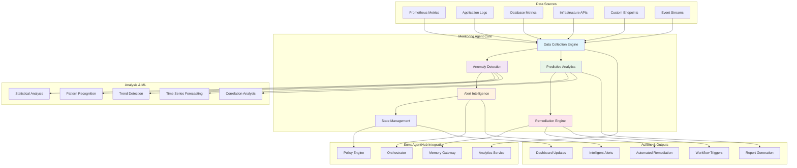

# Monitoring Agent - System Health & Observability


**Advanced agent pattern for comprehensive system monitoring and intelligent observability**

> Build sophisticated monitoring agents that can observe system health, detect anomalies, predict failures, and trigger automated remediation actions within the SomaAgentHub ecosystem.

---

## 📋 Overview

The Monitoring Agent pattern represents the pinnacle of autonomous system observability. This pattern enables agents to:

- **Monitor system health** across distributed services and infrastructure
- **Detect anomalies** using machine learning and statistical analysis
- **Predict failures** before they impact system availability
- **Trigger automated remediation** actions based on intelligent decision-making
- **Generate intelligent reports** with actionable insights and recommendations
- **Integrate with existing monitoring** tools and alerting systems

---

## 🎯 Learning Objectives

By completing this guide, your monitoring agent will:

✅ **Collect metrics** from multiple sources (Prometheus, logs, APIs, databases)  
✅ **Detect anomalies** using statistical and ML-based approaches  
✅ **Predict system failures** with time-series forecasting  
✅ **Trigger automated remediation** actions through SomaAgentHub workflows  
✅ **Generate intelligent alerts** with context and recommended actions  
✅ **Maintain monitoring state** with persistent memory and learning capabilities  

---

## 🏗️ Monitoring Agent Architecture



---

## 🚀 Building Your Monitoring Agent

### Core Monitoring Agent Implementation

**Base Monitoring Agent Class:**
```python
import asyncio
import json
import logging
import time
import statistics
from datetime import datetime, timedelta
from typing import Dict, List, Any, Optional, Tuple, Callable
from dataclasses import dataclass, asdict
from enum import Enum
import aiohttp
import numpy as np
from collections import defaultdict, deque
import hashlib
import pickle
import base64

class AlertSeverity(Enum):
    INFO = "info"
    WARNING = "warning"
    CRITICAL = "critical"
    EMERGENCY = "emergency"

class MetricType(Enum):
    COUNTER = "counter"
    GAUGE = "gauge"
    HISTOGRAM = "histogram"
    SUMMARY = "summary"

@dataclass
class MetricPoint:
    """Single metric data point"""
    name: str
    value: float
    timestamp: datetime
    labels: Dict[str, str]
    metric_type: MetricType
    
    def to_dict(self) -> Dict[str, Any]:
        return {
            **asdict(self),
            'timestamp': self.timestamp.isoformat(),
            'metric_type': self.metric_type.value
        }

@dataclass
class Anomaly:
    """Detected anomaly information"""
    metric_name: str
    timestamp: datetime
    actual_value: float
    expected_value: float
    deviation_score: float
    severity: AlertSeverity
    context: Dict[str, Any]
    
    def to_dict(self) -> Dict[str, Any]:
        return {
            **asdict(self),
            'timestamp': self.timestamp.isoformat(),
            'severity': self.severity.value
        }

@dataclass
class Prediction:
    """System failure prediction"""
    target_metric: str
    prediction_horizon: timedelta
    failure_probability: float
    predicted_failure_time: Optional[datetime]
    confidence_score: float
    contributing_factors: List[str]
    
    def to_dict(self) -> Dict[str, Any]:
        return {
            **asdict(self),
            'prediction_horizon': self.prediction_horizon.total_seconds(),
            'predicted_failure_time': self.predicted_failure_time.isoformat() if self.predicted_failure_time else None
        }

class MonitoringAgent:
    """
    Advanced monitoring agent for comprehensive system observability
    
    Features:
    - Multi-source metric collection (Prometheus, logs, APIs, databases)
    - Real-time anomaly detection using statistical and ML methods
    - Predictive failure analysis with time-series forecasting
    - Intelligent alerting with context and recommended actions
    - Automated remediation through SomaAgentHub workflows
    - Persistent learning and adaptation capabilities
    """
    
    def __init__(self, 
                 agent_name: str,
                 soma_base_url: str = "http://localhost",
                 prometheus_url: str = "http://localhost:9090"):
        self.agent_name = agent_name
        self.soma_base_url = soma_base_url
        self.prometheus_url = prometheus_url
        
        # Core components
        self.logger = self._setup_logging()
        self.session = None
        self.token = None
        self.token_expires = None
        
        # Monitoring state
        self.metrics_buffer: Dict[str, deque] = defaultdict(lambda: deque(maxlen=1000))
        self.anomaly_detectors: Dict[str, 'AnomalyDetector'] = {}
        self.predictive_models: Dict[str, 'PredictiveModel'] = {}
        self.alert_history: deque = deque(maxlen=10000)
        self.remediation_actions: Dict[str, Callable] = {}
        
        # Configuration
        self.config = {
            'collection_interval': 30,  # seconds
            'anomaly_threshold': 2.0,   # standard deviations
            'prediction_horizon': 3600, # seconds
            'alert_cooldown': 300,      # seconds
            'max_remediation_attempts': 3,
            'learning_window': 86400,   # seconds (24 hours)
        }
        
        # Monitoring targets
        self.monitoring_targets = {
            'system_metrics': [
                'cpu_usage_percent',
                'memory_usage_percent', 
                'disk_usage_percent',
                'network_io_bytes',
                'load_average'
            ],
            'application_metrics': [
                'http_requests_total',
                'http_request_duration_seconds',
                'database_connections_active',
                'queue_size',
                'error_rate'
            ],
            'business_metrics': [
                'active_users',
                'transaction_volume',
                'revenue_per_hour',
                'conversion_rate'
            ]
        }
        
        # Alert suppression
        self.alert_suppressions: Dict[str, datetime] = {}
        
        # Statistics tracking
        self.stats = {
            'metrics_collected': 0,
            'anomalies_detected': 0,
            'predictions_made': 0,
            'alerts_sent': 0,
            'remediations_triggered': 0,
            'false_positives': 0,
            'true_positives': 0
        }
    
    def _setup_logging(self) -> logging.Logger:
        """Setup structured logging for the monitoring agent"""
        logger = logging.getLogger(f"monitoring.{self.agent_name}")
        handler = logging.StreamHandler()
        formatter = logging.Formatter(
            '%(asctime)s - %(name)s - %(levelname)s - [%(funcName)s:%(lineno)d] - %(message)s'
        )
        handler.setFormatter(formatter)
        logger.addHandler(handler)
        logger.setLevel(logging.INFO)
        return logger
    
    async def __aenter__(self):
        """Async context manager entry"""
        await self.initialize()
        return self
    
    async def __aexit__(self, exc_type, exc_val, exc_tb):
        """Async context manager exit"""
        await self.shutdown()
    
    async def initialize(self):
        """Initialize all monitoring agent components"""
        self.logger.info("Initializing Monitoring Agent...")
        
        # Initialize HTTP session
        self.session = aiohttp.ClientSession()
        
        # Authenticate with SomaAgentHub
        await self.authenticate()
        
        # Load historical data and models
        await self.load_monitoring_state()
        
        # Initialize anomaly detectors
        self.initialize_anomaly_detectors()
        
        # Initialize predictive models
        self.initialize_predictive_models()
        
        # Register remediation actions
        self.register_remediation_actions()
        
        self.logger.info("Monitoring Agent initialized successfully")
    
    async def authenticate(self) -> bool:
        """Authenticate with SomaAgentHub identity service"""
        try:
            async with self.session.post(
                f"{self.soma_base_url}:10002/v1/tokens/service",
                json={
                    "service_name": self.agent_name,
                    "scopes": ["agent:execute", "monitoring:read", "workflows:trigger", "memory:write"]
                }
            ) as response:
                if response.status == 200:
                    data = await response.json()
                    self.token = data["access_token"]
                    self.token_expires = datetime.now() + timedelta(seconds=data["expires_in"] - 60)
                    self.logger.info("Authentication successful")
                    return True
                else:
                    self.logger.error(f"Authentication failed: {response.status}")
                    return False
        except Exception as e:
            self.logger.error(f"Authentication error: {e}")
            return False
    
    async def load_monitoring_state(self):
        """Load historical monitoring state from memory gateway"""
        try:
            headers = {"Authorization": f"Bearer {self.token}"}
            
            # Load anomaly detector states
            async with self.session.get(
                f"{self.soma_base_url}:10021/kv/monitoring:{self.agent_name}:detectors",
                headers=headers
            ) as response:
                if response.status == 200:
                    data = await response.json()
                    detector_states = data.get('data', {})
                    self.logger.info(f"Loaded {len(detector_states)} detector states")
                    
            # Load predictive model states
            async with self.session.get(
                f"{self.soma_base_url}:10021/kv/monitoring:{self.agent_name}:models",
                headers=headers
            ) as response:
                if response.status == 200:
                    data = await response.json()
                    model_states = data.get('data', {})
                    self.logger.info(f"Loaded {len(model_states)} model states")
                    
        except Exception as e:
            self.logger.warning(f"Failed to load monitoring state: {e}")
    
    def initialize_anomaly_detectors(self):
        """Initialize anomaly detectors for each metric"""
        all_metrics = []
        for category, metrics in self.monitoring_targets.items():
            all_metrics.extend(metrics)
        
        for metric_name in all_metrics:
            self.anomaly_detectors[metric_name] = AnomalyDetector(
                metric_name=metric_name,
                window_size=100,
                threshold=self.config['anomaly_threshold']
            )
        
        self.logger.info(f"Initialized {len(self.anomaly_detectors)} anomaly detectors")
    
    def initialize_predictive_models(self):
        """Initialize predictive models for failure prediction"""
        critical_metrics = [
            'cpu_usage_percent',
            'memory_usage_percent',
            'disk_usage_percent',
            'error_rate',
            'http_request_duration_seconds'
        ]
        
        for metric_name in critical_metrics:
            self.predictive_models[metric_name] = PredictiveModel(
                metric_name=metric_name,
                prediction_horizon=self.config['prediction_horizon']
            )
        
        self.logger.info(f"Initialized {len(self.predictive_models)} predictive models")
    
    def register_remediation_actions(self):
        """Register automated remediation actions"""
        self.remediation_actions = {
            'high_cpu_usage': self.remediate_high_cpu,
            'high_memory_usage': self.remediate_high_memory,
            'high_error_rate': self.remediate_high_error_rate,
            'service_unavailable': self.remediate_service_unavailable,
            'database_connection_issues': self.remediate_database_issues,
            'disk_space_low': self.remediate_disk_space,
        }
        
        self.logger.info(f"Registered {len(self.remediation_actions)} remediation actions")
    
    async def start_monitoring(self):
        """Start the main monitoring loop"""
        self.logger.info("Starting monitoring loop...")
        
        # Start concurrent monitoring tasks
        tasks = [
            asyncio.create_task(self.collect_metrics_loop()),
            asyncio.create_task(self.analyze_metrics_loop()),
            asyncio.create_task(self.predict_failures_loop()),
            asyncio.create_task(self.process_alerts_loop()),
            asyncio.create_task(self.save_state_loop()),
            asyncio.create_task(self.health_check_loop())
        ]
        
        try:
            await asyncio.gather(*tasks)
        except Exception as e:
            self.logger.error(f"Monitoring loop error: {e}")
            raise
    
    async def collect_metrics_loop(self):
        """Main metrics collection loop"""
        while True:
            try:
                start_time = time.time()
                
                # Collect from all sources
                await asyncio.gather(
                    self.collect_prometheus_metrics(),
                    self.collect_application_metrics(),
                    self.collect_infrastructure_metrics(),
                    self.collect_business_metrics(),
                    return_exceptions=True
                )
                
                collection_time = time.time() - start_time
                self.logger.debug(f"Metrics collection completed in {collection_time:.2f}s")
                
                # Wait for next collection interval
                await asyncio.sleep(self.config['collection_interval'])
                
            except Exception as e:
                self.logger.error(f"Metrics collection error: {e}")
                await asyncio.sleep(self.config['collection_interval'])
    
    async def collect_prometheus_metrics(self):
        """Collect metrics from Prometheus"""
        try:
            # Query Prometheus for system metrics
            queries = {
                'cpu_usage_percent': 'avg(100 - (avg by (instance) (rate(node_cpu_seconds_total{mode="idle"}[5m])) * 100))',
                'memory_usage_percent': 'avg((1 - (node_memory_MemAvailable_bytes / node_memory_MemTotal_bytes)) * 100)',
                'disk_usage_percent': 'avg((1 - (node_filesystem_avail_bytes / node_filesystem_size_bytes)) * 100)',
                'load_average': 'avg(node_load1)',
                'http_requests_total': 'sum(rate(http_requests_total[5m]))',
                'http_request_duration_seconds': 'avg(http_request_duration_seconds)',
                'error_rate': 'sum(rate(http_requests_total{status=~"5.."}[5m])) / sum(rate(http_requests_total[5m]))'
            }
            
            for metric_name, query in queries.items():
                try:
                    async with self.session.get(
                        f"{self.prometheus_url}/api/v1/query",
                        params={'query': query}
                    ) as response:
                        if response.status == 200:
                            data = await response.json()
                            result = data.get('data', {}).get('result', [])
                            
                            if result:
                                value = float(result[0]['value'][1])
                                metric_point = MetricPoint(
                                    name=metric_name,
                                    value=value,
                                    timestamp=datetime.now(),
                                    labels={'source': 'prometheus'},
                                    metric_type=MetricType.GAUGE
                                )
                                
                                self.metrics_buffer[metric_name].append(metric_point)
                                self.stats['metrics_collected'] += 1
                                
                except Exception as e:
                    self.logger.warning(f"Failed to collect {metric_name}: {e}")
                    
        except Exception as e:
            self.logger.error(f"Prometheus collection error: {e}")
    
    async def collect_application_metrics(self):
        """Collect application-specific metrics"""
        try:
            # Collect from SomaAgentHub services
            services = {
                'gateway-api': f"{self.soma_base_url}:10000/metrics",
                'orchestrator': f"{self.soma_base_url}:10001/metrics",
                'identity-service': f"{self.soma_base_url}:10002/metrics",
                'memory-gateway': f"{self.soma_base_url}:10021/metrics",
                'policy-engine': f"{self.soma_base_url}:10020/metrics"
            }
            
            for service_name, metrics_url in services.items():
                try:
                    async with self.session.get(metrics_url, timeout=10) as response:
                        if response.status == 200:
                            metrics_text = await response.text()
                            parsed_metrics = self.parse_prometheus_metrics(metrics_text, service_name)
                            
                            for metric in parsed_metrics:
                                self.metrics_buffer[metric.name].append(metric)
                                self.stats['metrics_collected'] += 1
                                
                except Exception as e:
                    self.logger.warning(f"Failed to collect metrics from {service_name}: {e}")
                    
        except Exception as e:
            self.logger.error(f"Application metrics collection error: {e}")
    
    async def collect_infrastructure_metrics(self):
        """Collect infrastructure metrics from various sources"""
        try:
            # Collect Kubernetes metrics
            await self.collect_kubernetes_metrics()
            
            # Collect database metrics
            await self.collect_database_metrics()
            
            # Collect message queue metrics
            await self.collect_message_queue_metrics()
            
        except Exception as e:
            self.logger.error(f"Infrastructure metrics collection error: {e}")
    
    async def collect_business_metrics(self):
        """Collect business-specific metrics"""
        try:
            # Example: Collect from analytics service
            headers = {"Authorization": f"Bearer {self.token}"}
            
            async with self.session.get(
                f"{self.soma_base_url}:10025/v1/metrics/business",
                headers=headers
            ) as response:
                if response.status == 200:
                    data = await response.json()
                    
                    for metric_name, value in data.items():
                        metric_point = MetricPoint(
                            name=metric_name,
                            value=float(value),
                            timestamp=datetime.now(),
                            labels={'source': 'business'},
                            metric_type=MetricType.GAUGE
                        )
                        
                        self.metrics_buffer[metric_name].append(metric_point)
                        self.stats['metrics_collected'] += 1
                        
        except Exception as e:
            self.logger.debug(f"Business metrics collection error: {e}")  # Debug level - optional
    
    def parse_prometheus_metrics(self, metrics_text: str, service_name: str) -> List[MetricPoint]:
        """Parse Prometheus metrics format"""
        metrics = []
        
        for line in metrics_text.split('\n'):
            line = line.strip()
            if line and not line.startswith('#'):
                try:
                    # Simple parsing - in production, use prometheus_client parser
                    parts = line.split(' ')
                    if len(parts) >= 2:
                        metric_name = parts[0]
                        value = float(parts[1])
                        
                        metric_point = MetricPoint(
                            name=f"{service_name}_{metric_name}",
                            value=value,
                            timestamp=datetime.now(),
                            labels={'service': service_name, 'source': 'prometheus'},
                            metric_type=MetricType.GAUGE
                        )
                        
                        metrics.append(metric_point)
                        
                except Exception as e:
                    continue  # Skip malformed lines
        
        return metrics
    
    async def analyze_metrics_loop(self):
        """Main metrics analysis loop"""
        while True:
            try:
                start_time = time.time()
                
                # Analyze all metrics for anomalies
                anomalies = await self.detect_anomalies()
                
                # Process detected anomalies
                for anomaly in anomalies:
                    await self.process_anomaly(anomaly)
                
                analysis_time = time.time() - start_time
                self.logger.debug(f"Metrics analysis completed in {analysis_time:.2f}s, found {len(anomalies)} anomalies")
                
                # Wait before next analysis
                await asyncio.sleep(60)  # Analyze every minute
                
            except Exception as e:
                self.logger.error(f"Metrics analysis error: {e}")
                await asyncio.sleep(60)
    
    async def detect_anomalies(self) -> List[Anomaly]:
        """Detect anomalies in collected metrics"""
        anomalies = []
        
        for metric_name, detector in self.anomaly_detectors.items():
            if metric_name in self.metrics_buffer and self.metrics_buffer[metric_name]:
                # Get recent metric points
                recent_points = list(self.metrics_buffer[metric_name])[-detector.window_size:]
                
                if len(recent_points) >= detector.min_points:
                    # Detect anomalies
                    detected_anomalies = detector.detect_anomalies(recent_points)
                    anomalies.extend(detected_anomalies)
                    
                    if detected_anomalies:
                        self.stats['anomalies_detected'] += len(detected_anomalies)
        
        return anomalies
    
    async def process_anomaly(self, anomaly: Anomaly):
        """Process a detected anomaly"""
        try:
            # Check if this anomaly should be suppressed
            suppression_key = f"{anomaly.metric_name}_{anomaly.severity.value}"
            if suppression_key in self.alert_suppressions:
                if datetime.now() < self.alert_suppressions[suppression_key]:
                    return  # Still in suppression period
            
            # Log the anomaly
            self.logger.warning(f"Anomaly detected: {anomaly.metric_name} = {anomaly.actual_value:.2f} "
                              f"(expected: {anomaly.expected_value:.2f}, deviation: {anomaly.deviation_score:.2f})")
            
            # Generate intelligent alert
            alert = await self.generate_intelligent_alert(anomaly)
            
            # Send alert
            await self.send_alert(alert)
            
            # Trigger remediation if applicable
            if anomaly.severity in [AlertSeverity.CRITICAL, AlertSeverity.EMERGENCY]:
                await self.trigger_remediation(anomaly)
            
            # Set suppression period
            self.alert_suppressions[suppression_key] = datetime.now() + timedelta(seconds=self.config['alert_cooldown'])
            
            # Store in alert history
            self.alert_history.append({
                'anomaly': anomaly.to_dict(),
                'alert': alert,
                'timestamp': datetime.now().isoformat(),
                'remediation_triggered': anomaly.severity in [AlertSeverity.CRITICAL, AlertSeverity.EMERGENCY]
            })
            
        except Exception as e:
            self.logger.error(f"Anomaly processing error: {e}")
    
    async def generate_intelligent_alert(self, anomaly: Anomaly) -> Dict[str, Any]:
        """Generate intelligent alert with context and recommendations"""
        try:
            # Analyze related metrics for context
            related_metrics = await self.analyze_related_metrics(anomaly.metric_name)
            
            # Generate recommendations
            recommendations = await self.generate_recommendations(anomaly, related_metrics)
            
            # Create alert
            alert = {
                'id': hashlib.md5(f"{anomaly.metric_name}_{anomaly.timestamp}".encode()).hexdigest(),
                'title': f"Anomaly Detected: {anomaly.metric_name}",
                'severity': anomaly.severity.value,
                'timestamp': anomaly.timestamp.isoformat(),
                'metric': {
                    'name': anomaly.metric_name,
                    'actual_value': anomaly.actual_value,
                    'expected_value': anomaly.expected_value,
                    'deviation_score': anomaly.deviation_score
                },
                'context': {
                    'related_metrics': related_metrics,
                    'historical_patterns': await self.get_historical_patterns(anomaly.metric_name),
                    'system_state': await self.get_current_system_state()
                },
                'recommendations': recommendations,
                'urgency': self.calculate_urgency(anomaly),
                'impact_assessment': await self.assess_impact(anomaly)
            }
            
            return alert
            
        except Exception as e:
            self.logger.error(f"Alert generation error: {e}")
            return {
                'id': 'error',
                'title': f"Anomaly Detected: {anomaly.metric_name}",
                'severity': anomaly.severity.value,
                'timestamp': anomaly.timestamp.isoformat(),
                'error': str(e)
            }
    
    async def analyze_related_metrics(self, metric_name: str) -> Dict[str, Any]:
        """Analyze metrics related to the anomalous metric"""
        related_metrics = {}
        
        # Define metric relationships
        relationships = {
            'cpu_usage_percent': ['memory_usage_percent', 'load_average', 'http_request_duration_seconds'],
            'memory_usage_percent': ['cpu_usage_percent', 'database_connections_active'],
            'error_rate': ['http_request_duration_seconds', 'database_connections_active'],
            'http_request_duration_seconds': ['cpu_usage_percent', 'memory_usage_percent', 'error_rate']
        }
        
        related_metric_names = relationships.get(metric_name, [])
        
        for related_name in related_metric_names:
            if related_name in self.metrics_buffer and self.metrics_buffer[related_name]:
                recent_points = list(self.metrics_buffer[related_name])[-10:]  # Last 10 points
                if recent_points:
                    values = [p.value for p in recent_points]
                    related_metrics[related_name] = {
                        'current_value': values[-1],
                        'average': statistics.mean(values),
                        'trend': 'increasing' if values[-1] > values[0] else 'decreasing'
                    }
        
        return related_metrics
    
    async def generate_recommendations(self, anomaly: Anomaly, related_metrics: Dict[str, Any]) -> List[str]:
        """Generate actionable recommendations based on anomaly and context"""
        recommendations = []
        
        metric_name = anomaly.metric_name
        severity = anomaly.severity
        
        # CPU usage recommendations
        if 'cpu' in metric_name.lower():
            if severity in [AlertSeverity.CRITICAL, AlertSeverity.EMERGENCY]:
                recommendations.extend([
                    "Consider scaling up CPU resources or adding more instances",
                    "Check for CPU-intensive processes and optimize or terminate if necessary",
                    "Review recent deployments that might have increased CPU usage"
                ])
            else:
                recommendations.extend([
                    "Monitor CPU usage trends and plan for capacity scaling",
                    "Review application performance and optimize CPU-intensive operations"
                ])
        
        # Memory usage recommendations
        elif 'memory' in metric_name.lower():
            if severity in [AlertSeverity.CRITICAL, AlertSeverity.EMERGENCY]:
                recommendations.extend([
                    "Immediately check for memory leaks in applications",
                    "Consider increasing memory allocation or scaling instances",
                    "Review and restart services with high memory consumption"
                ])
            else:
                recommendations.extend([
                    "Monitor memory usage patterns and identify optimization opportunities",
                    "Review application memory allocation and garbage collection settings"
                ])
        
        # Error rate recommendations
        elif 'error' in metric_name.lower():
            recommendations.extend([
                "Check application logs for error patterns and root causes",
                "Verify database connectivity and external service availability",
                "Review recent code deployments for potential issues",
                "Consider implementing circuit breakers for external dependencies"
            ])
        
        # Response time recommendations
        elif 'duration' in metric_name.lower() or 'latency' in metric_name.lower():
            recommendations.extend([
                "Check database query performance and optimize slow queries",
                "Review network connectivity and external service response times",
                "Consider implementing caching for frequently accessed data",
                "Monitor resource utilization (CPU, memory, I/O) for bottlenecks"
            ])
        
        # Add context-based recommendations
        if related_metrics:
            if any('cpu' in name and data['trend'] == 'increasing' for name, data in related_metrics.items()):
                recommendations.append("High CPU usage detected in related metrics - consider resource optimization")
            
            if any('memory' in name and data['current_value'] > 80 for name, data in related_metrics.items()):
                recommendations.append("High memory usage in related metrics - investigate potential memory leaks")
        
        return recommendations[:5]  # Limit to top 5 recommendations
    
    async def predict_failures_loop(self):
        """Main failure prediction loop"""
        while True:
            try:
                start_time = time.time()
                
                # Generate predictions for all models
                predictions = await self.generate_failure_predictions()
                
                # Process predictions
                for prediction in predictions:
                    await self.process_prediction(prediction)
                
                prediction_time = time.time() - start_time
                self.logger.debug(f"Failure prediction completed in {prediction_time:.2f}s, generated {len(predictions)} predictions")
                
                # Wait before next prediction cycle
                await asyncio.sleep(300)  # Predict every 5 minutes
                
            except Exception as e:
                self.logger.error(f"Failure prediction error: {e}")
                await asyncio.sleep(300)
    
    async def generate_failure_predictions(self) -> List[Prediction]:
        """Generate failure predictions using predictive models"""
        predictions = []
        
        for metric_name, model in self.predictive_models.items():
            if metric_name in self.metrics_buffer and self.metrics_buffer[metric_name]:
                # Get historical data
                historical_points = list(self.metrics_buffer[metric_name])
                
                if len(historical_points) >= model.min_data_points:
                    # Generate prediction
                    prediction = model.predict_failure(historical_points)
                    
                    if prediction:
                        predictions.append(prediction)
                        self.stats['predictions_made'] += 1
        
        return predictions
    
    async def process_prediction(self, prediction: Prediction):
        """Process a failure prediction"""
        try:
            if prediction.failure_probability > 0.7:  # High probability threshold
                self.logger.warning(f"High failure probability predicted for {prediction.target_metric}: "
                                  f"{prediction.failure_probability:.2f} within {prediction.prediction_horizon}")
                
                # Generate predictive alert
                alert = {
                    'id': hashlib.md5(f"prediction_{prediction.target_metric}_{datetime.now()}".encode()).hexdigest(),
                    'title': f"Failure Prediction: {prediction.target_metric}",
                    'severity': 'warning',
                    'type': 'predictive',
                    'timestamp': datetime.now().isoformat(),
                    'prediction': prediction.to_dict(),
                    'recommendations': [
                        f"Monitor {prediction.target_metric} closely",
                        "Consider proactive scaling or optimization",
                        "Review contributing factors and address root causes"
                    ]
                }
                
                await self.send_alert(alert)
                
                # Trigger proactive remediation
                await self.trigger_proactive_remediation(prediction)
                
        except Exception as e:
            self.logger.error(f"Prediction processing error: {e}")
    
    async def trigger_remediation(self, anomaly: Anomaly):
        """Trigger automated remediation for anomaly"""
        try:
            # Determine remediation action based on metric and severity
            action_key = self.determine_remediation_action(anomaly)
            
            if action_key in self.remediation_actions:
                self.logger.info(f"Triggering remediation action: {action_key}")
                
                # Execute remediation action
                success = await self.remediation_actions[action_key](anomaly)
                
                if success:
                    self.stats['remediations_triggered'] += 1
                    self.logger.info(f"Remediation action {action_key} completed successfully")
                else:
                    self.logger.error(f"Remediation action {action_key} failed")
                    
        except Exception as e:
            self.logger.error(f"Remediation trigger error: {e}")
    
    def determine_remediation_action(self, anomaly: Anomaly) -> str:
        """Determine appropriate remediation action for anomaly"""
        metric_name = anomaly.metric_name.lower()
        
        if 'cpu' in metric_name and anomaly.actual_value > 90:
            return 'high_cpu_usage'
        elif 'memory' in metric_name and anomaly.actual_value > 90:
            return 'high_memory_usage'
        elif 'error' in metric_name and anomaly.actual_value > 0.05:  # 5% error rate
            return 'high_error_rate'
        elif 'disk' in metric_name and anomaly.actual_value > 90:
            return 'disk_space_low'
        else:
            return 'generic_remediation'
    
    # Remediation action implementations
    async def remediate_high_cpu(self, anomaly: Anomaly) -> bool:
        """Remediate high CPU usage"""
        try:
            # Trigger workflow to scale up resources
            headers = {"Authorization": f"Bearer {self.token}"}
            
            workflow_request = {
                "workflow_type": "auto_scaling",
                "trigger_reason": "high_cpu_usage",
                "metric_data": anomaly.to_dict(),
                "scaling_config": {
                    "resource_type": "cpu",
                    "scale_factor": 1.5,
                    "max_instances": 10
                }
            }
            
            async with self.session.post(
                f"{self.soma_base_url}:10001/v1/workflows/execute",
                headers=headers,
                json=workflow_request
            ) as response:
                return response.status == 200
                
        except Exception as e:
            self.logger.error(f"CPU remediation error: {e}")
            return False
    
    async def remediate_high_memory(self, anomaly: Anomaly) -> bool:
        """Remediate high memory usage"""
        try:
            # Trigger memory optimization workflow
            headers = {"Authorization": f"Bearer {self.token}"}
            
            workflow_request = {
                "workflow_type": "memory_optimization",
                "trigger_reason": "high_memory_usage",
                "metric_data": anomaly.to_dict(),
                "optimization_config": {
                    "restart_services": True,
                    "garbage_collection": True,
                    "scale_memory": True
                }
            }
            
            async with self.session.post(
                f"{self.soma_base_url}:10001/v1/workflows/execute",
                headers=headers,
                json=workflow_request
            ) as response:
                return response.status == 200
                
        except Exception as e:
            self.logger.error(f"Memory remediation error: {e}")
            return False
    
    async def remediate_high_error_rate(self, anomaly: Anomaly) -> bool:
        """Remediate high error rate"""
        try:
            # Trigger error investigation and mitigation workflow
            headers = {"Authorization": f"Bearer {self.token}"}
            
            workflow_request = {
                "workflow_type": "error_mitigation",
                "trigger_reason": "high_error_rate",
                "metric_data": anomaly.to_dict(),
                "mitigation_config": {
                    "enable_circuit_breakers": True,
                    "increase_timeouts": True,
                    "rollback_recent_deployments": True
                }
            }
            
            async with self.session.post(
                f"{self.soma_base_url}:10001/v1/workflows/execute",
                headers=headers,
                json=workflow_request
            ) as response:
                return response.status == 200
                
        except Exception as e:
            self.logger.error(f"Error rate remediation error: {e}")
            return False
    
    async def send_alert(self, alert: Dict[str, Any]):
        """Send alert to notification systems"""
        try:
            # Send to SomaAgentHub notification service
            headers = {"Authorization": f"Bearer {self.token}"}
            
            async with self.session.post(
                f"{self.soma_base_url}:10024/v1/alerts",
                headers=headers,
                json=alert
            ) as response:
                if response.status == 200:
                    self.stats['alerts_sent'] += 1
                    self.logger.info(f"Alert sent: {alert['title']}")
                else:
                    self.logger.warning(f"Failed to send alert: {response.status}")
                    
        except Exception as e:
            self.logger.error(f"Alert sending error: {e}")
    
    async def shutdown(self):
        """Graceful shutdown of the monitoring agent"""
        self.logger.info("Shutting down Monitoring Agent...")
        
        # Save current state
        await self.save_monitoring_state()
        
        # Close HTTP session
        if self.session:
            await self.session.close()
        
        self.logger.info("Monitoring Agent shutdown complete")

class AnomalyDetector:
    """Statistical anomaly detector for time series data"""
    
    def __init__(self, metric_name: str, window_size: int = 100, threshold: float = 2.0):
        self.metric_name = metric_name
        self.window_size = window_size
        self.threshold = threshold
        self.min_points = 20
        
    def detect_anomalies(self, metric_points: List[MetricPoint]) -> List[Anomaly]:
        """Detect anomalies in metric points using statistical methods"""
        if len(metric_points) < self.min_points:
            return []
        
        anomalies = []
        values = [point.value for point in metric_points]
        
        # Calculate statistical measures
        mean = statistics.mean(values)
        stdev = statistics.stdev(values) if len(values) > 1 else 0
        
        if stdev == 0:
            return []  # No variation, no anomalies
        
        # Check recent points for anomalies
        recent_points = metric_points[-10:]  # Check last 10 points
        
        for point in recent_points:
            deviation = abs(point.value - mean) / stdev
            
            if deviation > self.threshold:
                severity = self.calculate_severity(deviation)
                
                anomaly = Anomaly(
                    metric_name=self.metric_name,
                    timestamp=point.timestamp,
                    actual_value=point.value,
                    expected_value=mean,
                    deviation_score=deviation,
                    severity=severity,
                    context={
                        'mean': mean,
                        'stdev': stdev,
                        'threshold': self.threshold,
                        'window_size': len(values)
                    }
                )
                
                anomalies.append(anomaly)
        
        return anomalies
    
    def calculate_severity(self, deviation: float) -> AlertSeverity:
        """Calculate alert severity based on deviation score"""
        if deviation > 4.0:
            return AlertSeverity.EMERGENCY
        elif deviation > 3.0:
            return AlertSeverity.CRITICAL
        elif deviation > 2.5:
            return AlertSeverity.WARNING
        else:
            return AlertSeverity.INFO

class PredictiveModel:
    """Simple predictive model for failure prediction"""
    
    def __init__(self, metric_name: str, prediction_horizon: int = 3600):
        self.metric_name = metric_name
        self.prediction_horizon = prediction_horizon  # seconds
        self.min_data_points = 50
        
    def predict_failure(self, metric_points: List[MetricPoint]) -> Optional[Prediction]:
        """Predict potential failures using trend analysis"""
        if len(metric_points) < self.min_data_points:
            return None
        
        try:
            # Simple trend-based prediction
            values = [point.value for point in metric_points[-50:]]  # Use last 50 points
            timestamps = [point.timestamp.timestamp() for point in metric_points[-50:]]
            
            # Calculate trend
            if len(values) < 2:
                return None
            
            # Linear regression for trend
            x = np.array(timestamps)
            y = np.array(values)
            
            # Normalize x to avoid numerical issues
            x_norm = (x - x[0]) / (x[-1] - x[0]) if x[-1] != x[0] else np.zeros_like(x)
            
            # Simple linear regression
            slope = np.corrcoef(x_norm, y)[0, 1] * np.std(y) / np.std(x_norm) if np.std(x_norm) > 0 else 0
            intercept = np.mean(y) - slope * np.mean(x_norm)
            
            # Predict future value
            future_time_norm = 1 + (self.prediction_horizon / (x[-1] - x[0])) if x[-1] != x[0] else 1
            predicted_value = slope * future_time_norm + intercept
            
            # Determine failure probability based on metric type and predicted value
            failure_probability = self.calculate_failure_probability(predicted_value, values)
            
            if failure_probability > 0.3:  # Only return predictions with significant probability
                return Prediction(
                    target_metric=self.metric_name,
                    prediction_horizon=timedelta(seconds=self.prediction_horizon),
                    failure_probability=failure_probability,
                    predicted_failure_time=datetime.now() + timedelta(seconds=self.prediction_horizon),
                    confidence_score=min(len(values) / 100.0, 1.0),  # Confidence based on data points
                    contributing_factors=self.identify_contributing_factors(values)
                )
            
            return None
            
        except Exception as e:
            return None
    
    def calculate_failure_probability(self, predicted_value: float, historical_values: List[float]) -> float:
        """Calculate failure probability based on predicted value and historical data"""
        try:
            # Define failure thresholds based on metric type
            if 'cpu' in self.metric_name.lower() or 'memory' in self.metric_name.lower():
                failure_threshold = 95.0  # 95% usage
            elif 'disk' in self.metric_name.lower():
                failure_threshold = 90.0  # 90% disk usage
            elif 'error' in self.metric_name.lower():
                failure_threshold = 0.1   # 10% error rate
            else:
                # Use statistical approach for other metrics
                mean = statistics.mean(historical_values)
                stdev = statistics.stdev(historical_values) if len(historical_values) > 1 else 0
                failure_threshold = mean + 3 * stdev  # 3 sigma threshold
            
            # Calculate probability based on how close predicted value is to threshold
            if predicted_value >= failure_threshold:
                return 1.0
            else:
                # Linear probability increase as we approach threshold
                current_max = max(historical_values)
                if current_max >= failure_threshold:
                    return 0.8  # Already at threshold
                else:
                    distance_to_threshold = failure_threshold - current_max
                    predicted_distance = failure_threshold - predicted_value
                    return max(0.0, 1.0 - (predicted_distance / distance_to_threshold))
                    
        except Exception:
            return 0.0
    
    def identify_contributing_factors(self, values: List[float]) -> List[str]:
        """Identify factors contributing to potential failure"""
        factors = []
        
        if len(values) < 2:
            return factors
        
        # Check for increasing trend
        recent_trend = (values[-1] - values[-10]) / 10 if len(values) >= 10 else (values[-1] - values[0])
        if recent_trend > 0:
            factors.append("Increasing trend detected")
        
        # Check for high variability
        if len(values) > 1:
            stdev = statistics.stdev(values)
            mean = statistics.mean(values)
            cv = stdev / mean if mean != 0 else 0
            if cv > 0.3:  # High coefficient of variation
                factors.append("High variability in metric values")
        
        # Check for recent spikes
        if len(values) >= 5:
            recent_max = max(values[-5:])
            overall_mean = statistics.mean(values)
            if recent_max > overall_mean * 1.5:
                factors.append("Recent spike in metric values")
        
        return factors
```

### Example Usage

**main.py:**
```python
#!/usr/bin/env python3
"""
Monitoring Agent Example
Demonstrates comprehensive system monitoring with anomaly detection and predictive analytics
"""

import asyncio
from monitoring_agent import MonitoringAgent

async def main():
    """Main function to run the monitoring agent"""
    
    # Initialize monitoring agent
    async with MonitoringAgent("production-monitoring-agent") as agent:
        
        print("🔍 Starting Monitoring Agent...")
        print("Features enabled:")
        print("  ✅ Multi-source metric collection")
        print("  ✅ Real-time anomaly detection")
        print("  ✅ Predictive failure analysis")
        print("  ✅ Intelligent alerting")
        print("  ✅ Automated remediation")
        print("  ✅ Persistent learning")
        
        # Start monitoring
        await agent.start_monitoring()

if __name__ == "__main__":
    try:
        asyncio.run(main())
    except KeyboardInterrupt:
        print("\n🛑 Monitoring Agent stopped by user")
    except Exception as e:
        print(f"❌ Monitoring Agent error: {e}")
```

---

## 🔄 What's Next?

### Advanced Monitoring Capabilities

Once your Monitoring Agent is operational:

1. **Implement custom ML models** for more sophisticated anomaly detection
2. **Add correlation analysis** to identify relationships between metrics
3. **Integrate with external monitoring** tools (Datadog, New Relic, etc.)
4. **Build custom dashboards** for real-time monitoring visualization
5. **Implement automated learning** to reduce false positives over time

### Final Agent Pattern

Complete your agent mastery with **[Security Hardening](security-hardening.md)** to learn:
- Advanced security practices for production agents
- Threat detection and response automation
- Compliance monitoring and reporting
- Zero-trust security implementation

---

**Congratulations! You've built a sophisticated Monitoring Agent capable of comprehensive system observability, intelligent anomaly detection, predictive failure analysis, and automated remediation. Your agent represents the state-of-the-art in autonomous system monitoring within the SomaAgentHub ecosystem.**