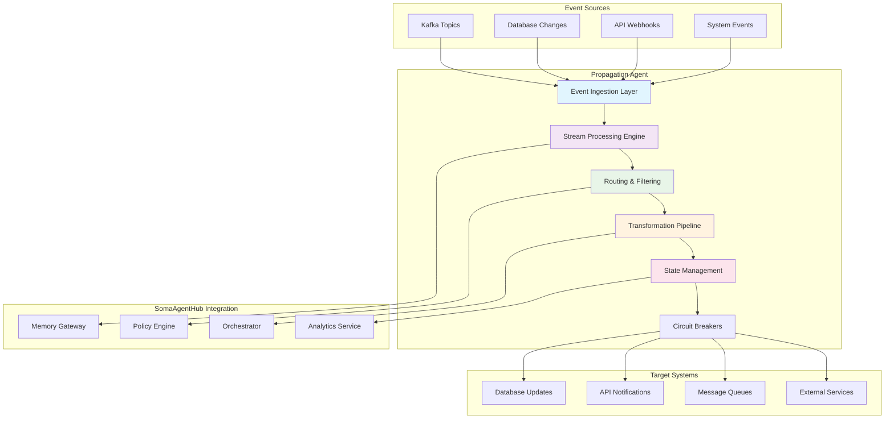

# Propagation Agent - Data Flow & Event Handling


**Advanced agent pattern for real-time data propagation and event processing**

> Build sophisticated agents that handle streaming data, process events in real-time, and propagate information across distributed systems within the SomaAgentHub ecosystem.

---

## 📋 Overview

The Propagation Agent pattern extends beyond basic task execution to handle continuous data flows, event streams, and real-time system interactions. This pattern is essential for agents that need to:

- **Process streaming data** from Kafka topics and event sources
- **Propagate changes** across multiple systems and services
- **Handle event-driven workflows** with complex routing logic
- **Maintain data consistency** across distributed components
- **React to system events** in real-time with minimal latency

---

## 🎯 Learning Objectives

By completing this guide, your propagation agent will:

✅ **Connect to event streams** and process real-time data  
✅ **Implement event routing** with intelligent filtering and transformation  
✅ **Handle backpressure** and flow control in high-volume scenarios  
✅ **Maintain state consistency** across distributed operations  
✅ **Implement circuit breakers** for resilient event processing  
✅ **Monitor data flow metrics** and detect anomalies  

---

## 🏗️ Propagation Agent Architecture



---

## 🚀 Building Your Propagation Agent

### Core Propagation Agent Implementation

**Base Propagation Agent Class:**
```python
import asyncio
import json
import logging
import time
from datetime import datetime, timedelta
from typing import Dict, List, Any, Optional, Callable, AsyncGenerator
from dataclasses import dataclass, asdict
from enum import Enum
import aiohttp
import aiokafka
from aiokafka import AIOKafkaConsumer, AIOKafkaProducer
from collections import defaultdict, deque
import hashlib

class EventType(Enum):
    DATA_CHANGE = "data_change"
    SYSTEM_EVENT = "system_event"
    USER_ACTION = "user_action"
    WORKFLOW_EVENT = "workflow_event"
    ERROR_EVENT = "error_event"

@dataclass
class PropagationEvent:
    """Standard event structure for propagation"""
    id: str
    type: EventType
    source: str
    timestamp: datetime
    data: Dict[str, Any]
    metadata: Dict[str, Any]
    routing_key: str
    priority: int = 5  # 1=highest, 10=lowest
    
    def to_dict(self) -> Dict[str, Any]:
        return {
            **asdict(self),
            'timestamp': self.timestamp.isoformat(),
            'type': self.type.value
        }
    
    @classmethod
    def from_dict(cls, data: Dict[str, Any]) -> 'PropagationEvent':
        return cls(
            id=data['id'],
            type=EventType(data['type']),
            source=data['source'],
            timestamp=datetime.fromisoformat(data['timestamp']),
            data=data['data'],
            metadata=data['metadata'],
            routing_key=data['routing_key'],
            priority=data.get('priority', 5)
        )

class PropagationAgent:
    """
    Advanced agent for real-time data propagation and event processing
    
    Features:
    - Multi-source event ingestion (Kafka, webhooks, database changes)
    - Intelligent event routing and filtering
    - Stream processing with backpressure handling
    - Circuit breaker pattern for resilience
    - State management and consistency guarantees
    - Comprehensive monitoring and metrics
    """
    
    def __init__(self, 
                 agent_name: str,
                 kafka_bootstrap_servers: str = "localhost:9092",
                 soma_base_url: str = "http://localhost"):
        self.agent_name = agent_name
        self.kafka_bootstrap_servers = kafka_bootstrap_servers
        self.soma_base_url = soma_base_url
        
        # Core components
        self.logger = self._setup_logging()
        self.session = None
        self.token = None
        self.token_expires = None
        
        # Event processing
        self.consumer = None
        self.producer = None
        self.event_handlers: Dict[EventType, List[Callable]] = defaultdict(list)
        self.routing_rules: List[Dict[str, Any]] = []
        self.processing_stats = defaultdict(int)
        
        # State management
        self.state_store: Dict[str, Any] = {}
        self.event_buffer: deque = deque(maxlen=10000)
        self.circuit_breakers: Dict[str, 'CircuitBreaker'] = {}
        
        # Configuration
        self.config = {
            'batch_size': 100,
            'batch_timeout': 5.0,
            'max_retries': 3,
            'backoff_multiplier': 2.0,
            'circuit_breaker_threshold': 5,
            'circuit_breaker_timeout': 60.0
        }
    
    def _setup_logging(self) -> logging.Logger:
        """Setup structured logging for the propagation agent"""
        logger = logging.getLogger(f"propagation.{self.agent_name}")
        handler = logging.StreamHandler()
        formatter = logging.Formatter(
            '%(asctime)s - %(name)s - %(levelname)s - [%(funcName)s:%(lineno)d] - %(message)s'
        )
        handler.setFormatter(formatter)
        logger.addHandler(handler)
        logger.setLevel(logging.INFO)
        return logger
    
    async def __aenter__(self):
        """Async context manager entry"""
        await self.initialize()
        return self
    
    async def __aexit__(self, exc_type, exc_val, exc_tb):
        """Async context manager exit"""
        await self.shutdown()
    
    async def initialize(self):
        """Initialize all agent components"""
        self.logger.info("Initializing Propagation Agent...")
        
        # Initialize HTTP session
        self.session = aiohttp.ClientSession()
        
        # Authenticate with SomaAgentHub
        await self.authenticate()
        
        # Initialize Kafka components
        await self.initialize_kafka()
        
        # Setup circuit breakers
        self.setup_circuit_breakers()
        
        self.logger.info("Propagation Agent initialized successfully")
    
    async def authenticate(self) -> bool:
        """Authenticate with SomaAgentHub identity service"""
        try:
            async with self.session.post(
                f"{self.soma_base_url}:10002/v1/tokens/service",
                json={
                    "service_name": self.agent_name,
                    "scopes": ["agent:execute", "events:publish", "memory:write"]
                }
            ) as response:
                if response.status == 200:
                    data = await response.json()
                    self.token = data["access_token"]
                    self.token_expires = datetime.now() + timedelta(seconds=data["expires_in"] - 60)
                    self.logger.info("Authentication successful")
                    return True
                else:
                    self.logger.error(f"Authentication failed: {response.status}")
                    return False
        except Exception as e:
            self.logger.error(f"Authentication error: {e}")
            return False
    
    async def initialize_kafka(self):
        """Initialize Kafka consumer and producer"""
        try:
            # Initialize consumer
            self.consumer = AIOKafkaConsumer(
                'soma-events', 'system-events', 'user-events',
                bootstrap_servers=self.kafka_bootstrap_servers,
                group_id=f"propagation-{self.agent_name}",
                value_deserializer=lambda m: json.loads(m.decode('utf-8')),
                auto_offset_reset='latest',
                enable_auto_commit=False
            )
            
            # Initialize producer
            self.producer = AIOKafkaProducer(
                bootstrap_servers=self.kafka_bootstrap_servers,
                value_serializer=lambda v: json.dumps(v).encode('utf-8'),
                compression_type="gzip"
            )
            
            await self.consumer.start()
            await self.producer.start()
            
            self.logger.info("Kafka components initialized")
            
        except Exception as e:
            self.logger.error(f"Kafka initialization error: {e}")
            raise
    
    def setup_circuit_breakers(self):
        """Setup circuit breakers for external services"""
        services = ['database', 'api_gateway', 'notification_service', 'analytics']
        
        for service in services:
            self.circuit_breakers[service] = CircuitBreaker(
                failure_threshold=self.config['circuit_breaker_threshold'],
                timeout=self.config['circuit_breaker_timeout'],
                name=service
            )
    
    def add_event_handler(self, event_type: EventType, handler: Callable):
        """Register event handler for specific event type"""
        self.event_handlers[event_type].append(handler)
        self.logger.info(f"Added handler for {event_type.value}")
    
    def add_routing_rule(self, rule: Dict[str, Any]):
        """Add routing rule for event propagation"""
        self.routing_rules.append(rule)
        self.logger.info(f"Added routing rule: {rule.get('name', 'unnamed')}")
    
    async def start_event_processing(self):
        """Start the main event processing loop"""
        self.logger.info("Starting event processing loop...")
        
        # Start concurrent tasks
        tasks = [
            asyncio.create_task(self.consume_events()),
            asyncio.create_task(self.process_event_buffer()),
            asyncio.create_task(self.monitor_health()),
            asyncio.create_task(self.report_metrics())
        ]
        
        try:
            await asyncio.gather(*tasks)
        except Exception as e:
            self.logger.error(f"Event processing error: {e}")
            raise
    
    async def consume_events(self):
        """Consume events from Kafka topics"""
        try:
            async for message in self.consumer:
                try:
                    # Parse event
                    event_data = message.value
                    event = PropagationEvent.from_dict(event_data)
                    
                    # Add to buffer for processing
                    self.event_buffer.append(event)
                    self.processing_stats['events_received'] += 1
                    
                    # Commit offset
                    await self.consumer.commit()
                    
                except Exception as e:
                    self.logger.error(f"Event parsing error: {e}")
                    self.processing_stats['parsing_errors'] += 1
                    
        except Exception as e:
            self.logger.error(f"Event consumption error: {e}")
            raise
    
    async def process_event_buffer(self):
        """Process events from the buffer in batches"""
        while True:
            try:
                if not self.event_buffer:
                    await asyncio.sleep(0.1)
                    continue
                
                # Collect batch of events
                batch = []
                batch_start = time.time()
                
                while (len(batch) < self.config['batch_size'] and 
                       self.event_buffer and 
                       time.time() - batch_start < self.config['batch_timeout']):
                    batch.append(self.event_buffer.popleft())
                
                if batch:
                    await self.process_event_batch(batch)
                    
            except Exception as e:
                self.logger.error(f"Batch processing error: {e}")
                await asyncio.sleep(1)
    
    async def process_event_batch(self, events: List[PropagationEvent]):
        """Process a batch of events"""
        self.logger.debug(f"Processing batch of {len(events)} events")
        
        # Group events by type for efficient processing
        events_by_type = defaultdict(list)
        for event in events:
            events_by_type[event.type].append(event)
        
        # Process each event type
        for event_type, type_events in events_by_type.items():
            await self.process_events_by_type(event_type, type_events)
        
        self.processing_stats['batches_processed'] += 1
        self.processing_stats['events_processed'] += len(events)
    
    async def process_events_by_type(self, event_type: EventType, events: List[PropagationEvent]):
        """Process events of a specific type"""
        try:
            # Apply routing rules
            routed_events = []
            for event in events:
                if self.should_route_event(event):
                    routed_events.append(event)
            
            if not routed_events:
                return
            
            # Execute registered handlers
            handlers = self.event_handlers.get(event_type, [])
            for handler in handlers:
                try:
                    await handler(routed_events)
                except Exception as e:
                    self.logger.error(f"Handler error for {event_type.value}: {e}")
                    self.processing_stats['handler_errors'] += 1
            
            # Propagate to target systems
            await self.propagate_events(routed_events)
            
        except Exception as e:
            self.logger.error(f"Event type processing error for {event_type.value}: {e}")
    
    def should_route_event(self, event: PropagationEvent) -> bool:
        """Check if event should be routed based on routing rules"""
        if not self.routing_rules:
            return True  # Route all events if no rules defined
        
        for rule in self.routing_rules:
            if self.evaluate_routing_rule(event, rule):
                return True
        
        return False
    
    def evaluate_routing_rule(self, event: PropagationEvent, rule: Dict[str, Any]) -> bool:
        """Evaluate a single routing rule against an event"""
        try:
            # Check event type
            if 'event_types' in rule:
                if event.type.value not in rule['event_types']:
                    return False
            
            # Check source
            if 'sources' in rule:
                if event.source not in rule['sources']:
                    return False
            
            # Check routing key pattern
            if 'routing_key_pattern' in rule:
                import re
                pattern = rule['routing_key_pattern']
                if not re.match(pattern, event.routing_key):
                    return False
            
            # Check data conditions
            if 'data_conditions' in rule:
                for condition in rule['data_conditions']:
                    if not self.evaluate_data_condition(event.data, condition):
                        return False
            
            # Check priority threshold
            if 'min_priority' in rule:
                if event.priority > rule['min_priority']:  # Lower number = higher priority
                    return False
            
            return True
            
        except Exception as e:
            self.logger.error(f"Routing rule evaluation error: {e}")
            return False
    
    def evaluate_data_condition(self, data: Dict[str, Any], condition: Dict[str, Any]) -> bool:
        """Evaluate a data condition against event data"""
        field = condition.get('field')
        operator = condition.get('operator')
        value = condition.get('value')
        
        if not all([field, operator, value is not None]):
            return False
        
        # Get field value from nested data
        field_value = self.get_nested_value(data, field)
        if field_value is None:
            return False
        
        # Apply operator
        if operator == 'equals':
            return field_value == value
        elif operator == 'not_equals':
            return field_value != value
        elif operator == 'greater_than':
            return field_value > value
        elif operator == 'less_than':
            return field_value < value
        elif operator == 'contains':
            return value in str(field_value)
        elif operator == 'in':
            return field_value in value
        else:
            return False
    
    def get_nested_value(self, data: Dict[str, Any], field: str) -> Any:
        """Get value from nested dictionary using dot notation"""
        keys = field.split('.')
        value = data
        
        for key in keys:
            if isinstance(value, dict) and key in value:
                value = value[key]
            else:
                return None
        
        return value
    
    async def propagate_events(self, events: List[PropagationEvent]):
        """Propagate events to target systems"""
        # Group events by target system for efficient propagation
        propagation_tasks = []
        
        # Database updates
        db_events = [e for e in events if 'database' in e.routing_key]
        if db_events:
            propagation_tasks.append(self.propagate_to_database(db_events))
        
        # API notifications
        api_events = [e for e in events if 'api' in e.routing_key]
        if api_events:
            propagation_tasks.append(self.propagate_to_apis(api_events))
        
        # Message queue publishing
        queue_events = [e for e in events if 'queue' in e.routing_key]
        if queue_events:
            propagation_tasks.append(self.propagate_to_queues(queue_events))
        
        # SomaAgentHub integration
        soma_events = [e for e in events if 'soma' in e.routing_key]
        if soma_events:
            propagation_tasks.append(self.propagate_to_soma(soma_events))
        
        # Execute all propagation tasks concurrently
        if propagation_tasks:
            await asyncio.gather(*propagation_tasks, return_exceptions=True)
    
    async def propagate_to_database(self, events: List[PropagationEvent]):
        """Propagate events to database systems"""
        circuit_breaker = self.circuit_breakers['database']
        
        try:
            async with circuit_breaker:
                # Batch database operations
                operations = []
                for event in events:
                    if event.type == EventType.DATA_CHANGE:
                        operations.append({
                            'operation': 'update',
                            'table': event.data.get('table'),
                            'id': event.data.get('id'),
                            'changes': event.data.get('changes'),
                            'timestamp': event.timestamp
                        })
                
                if operations:
                    await self.execute_database_operations(operations)
                    self.processing_stats['db_propagations'] += len(operations)
                    
        except Exception as e:
            self.logger.error(f"Database propagation error: {e}")
            self.processing_stats['db_errors'] += 1
    
    async def propagate_to_apis(self, events: List[PropagationEvent]):
        """Propagate events to external APIs"""
        circuit_breaker = self.circuit_breakers['api_gateway']
        
        try:
            async with circuit_breaker:
                # Send notifications to external APIs
                for event in events:
                    api_config = event.metadata.get('api_config', {})
                    if api_config:
                        await self.send_api_notification(event, api_config)
                        self.processing_stats['api_propagations'] += 1
                        
        except Exception as e:
            self.logger.error(f"API propagation error: {e}")
            self.processing_stats['api_errors'] += 1
    
    async def propagate_to_queues(self, events: List[PropagationEvent]):
        """Propagate events to message queues"""
        try:
            # Publish to Kafka topics
            for event in events:
                topic = event.metadata.get('target_topic', 'propagated-events')
                await self.producer.send(topic, event.to_dict())
                self.processing_stats['queue_propagations'] += 1
                
        except Exception as e:
            self.logger.error(f"Queue propagation error: {e}")
            self.processing_stats['queue_errors'] += 1
    
    async def propagate_to_soma(self, events: List[PropagationEvent]):
        """Propagate events to SomaAgentHub services"""
        try:
            # Store in memory gateway for agent recall
            for event in events:
                await self.store_event_in_memory(event)
            
            # Trigger workflows if needed
            workflow_events = [e for e in events if e.type == EventType.WORKFLOW_EVENT]
            for event in workflow_events:
                await self.trigger_soma_workflow(event)
            
            self.processing_stats['soma_propagations'] += len(events)
            
        except Exception as e:
            self.logger.error(f"SomaAgentHub propagation error: {e}")
            self.processing_stats['soma_errors'] += 1
    
    async def store_event_in_memory(self, event: PropagationEvent):
        """Store event in SomaAgentHub memory gateway"""
        try:
            headers = {"Authorization": f"Bearer {self.token}"}
            
            # Create vector embedding for semantic search
            event_text = f"{event.type.value} {event.source} {json.dumps(event.data)}"
            
            async with self.session.put(
                f"{self.soma_base_url}:10021/kv/events:{event.id}",
                headers=headers,
                json={
                    "event": event.to_dict(),
                    "searchable_text": event_text,
                    "stored_at": datetime.now().isoformat()
                }
            ) as response:
                if response.status != 200:
                    self.logger.warning(f"Failed to store event in memory: {response.status}")
                    
        except Exception as e:
            self.logger.error(f"Memory storage error: {e}")
    
    async def trigger_soma_workflow(self, event: PropagationEvent):
        """Trigger SomaAgentHub workflow based on event"""
        try:
            headers = {"Authorization": f"Bearer {self.token}"}
            
            workflow_config = event.metadata.get('workflow_config', {})
            
            async with self.session.post(
                f"{self.soma_base_url}:10001/v1/workflows/execute",
                headers=headers,
                json={
                    "workflow_type": workflow_config.get('type', 'event_triggered'),
                    "trigger_event": event.to_dict(),
                    "config": workflow_config
                }
            ) as response:
                if response.status == 200:
                    result = await response.json()
                    self.logger.info(f"Triggered workflow: {result.get('workflow_id')}")
                else:
                    self.logger.warning(f"Failed to trigger workflow: {response.status}")
                    
        except Exception as e:
            self.logger.error(f"Workflow trigger error: {e}")
    
    async def monitor_health(self):
        """Monitor agent health and system status"""
        while True:
            try:
                # Check Kafka connectivity
                kafka_healthy = await self.check_kafka_health()
                
                # Check SomaAgentHub services
                soma_healthy = await self.check_soma_health()
                
                # Check circuit breaker states
                circuit_states = {name: cb.state for name, cb in self.circuit_breakers.items()}
                
                # Log health status
                health_status = {
                    'kafka_healthy': kafka_healthy,
                    'soma_healthy': soma_healthy,
                    'circuit_breakers': circuit_states,
                    'buffer_size': len(self.event_buffer),
                    'processing_stats': dict(self.processing_stats)
                }
                
                self.logger.info(f"Health check: {health_status}")
                
                # Sleep for health check interval
                await asyncio.sleep(30)
                
            except Exception as e:
                self.logger.error(f"Health monitoring error: {e}")
                await asyncio.sleep(30)
    
    async def check_kafka_health(self) -> bool:
        """Check Kafka cluster health"""
        try:
            # Simple check - try to get cluster metadata
            metadata = await self.consumer.client.cluster.metadata()
            return len(metadata.brokers) > 0
        except Exception:
            return False
    
    async def check_soma_health(self) -> bool:
        """Check SomaAgentHub services health"""
        try:
            async with self.session.get(f"{self.soma_base_url}:10000/healthz") as response:
                return response.status == 200
        except Exception:
            return False
    
    async def report_metrics(self):
        """Report metrics to monitoring system"""
        while True:
            try:
                # Prepare metrics
                metrics = {
                    'agent_name': self.agent_name,
                    'timestamp': datetime.now().isoformat(),
                    'events_received': self.processing_stats['events_received'],
                    'events_processed': self.processing_stats['events_processed'],
                    'batches_processed': self.processing_stats['batches_processed'],
                    'buffer_size': len(self.event_buffer),
                    'error_counts': {
                        'parsing_errors': self.processing_stats['parsing_errors'],
                        'handler_errors': self.processing_stats['handler_errors'],
                        'db_errors': self.processing_stats['db_errors'],
                        'api_errors': self.processing_stats['api_errors'],
                        'queue_errors': self.processing_stats['queue_errors'],
                        'soma_errors': self.processing_stats['soma_errors']
                    }
                }
                
                # Send to analytics service
                await self.send_metrics(metrics)
                
                # Sleep for metrics interval
                await asyncio.sleep(60)
                
            except Exception as e:
                self.logger.error(f"Metrics reporting error: {e}")
                await asyncio.sleep(60)
    
    async def send_metrics(self, metrics: Dict[str, Any]):
        """Send metrics to SomaAgentHub analytics service"""
        try:
            headers = {"Authorization": f"Bearer {self.token}"}
            
            async with self.session.post(
                f"{self.soma_base_url}:10025/v1/metrics/agent",
                headers=headers,
                json=metrics
            ) as response:
                if response.status != 200:
                    self.logger.warning(f"Failed to send metrics: {response.status}")
                    
        except Exception as e:
            self.logger.debug(f"Metrics sending error: {e}")  # Debug level - not critical
    
    async def shutdown(self):
        """Graceful shutdown of the propagation agent"""
        self.logger.info("Shutting down Propagation Agent...")
        
        # Stop Kafka components
        if self.consumer:
            await self.consumer.stop()
        if self.producer:
            await self.producer.stop()
        
        # Close HTTP session
        if self.session:
            await self.session.close()
        
        self.logger.info("Propagation Agent shutdown complete")

class CircuitBreaker:
    """Circuit breaker implementation for resilient service calls"""
    
    def __init__(self, failure_threshold: int = 5, timeout: float = 60.0, name: str = "unknown"):
        self.failure_threshold = failure_threshold
        self.timeout = timeout
        self.name = name
        self.failure_count = 0
        self.last_failure_time = None
        self.state = "closed"  # closed, open, half-open
    
    async def __aenter__(self):
        if self.state == "open":
            if time.time() - self.last_failure_time > self.timeout:
                self.state = "half-open"
            else:
                raise Exception(f"Circuit breaker {self.name} is open")
        return self
    
    async def __aexit__(self, exc_type, exc_val, exc_tb):
        if exc_type is None:
            # Success
            self.failure_count = 0
            if self.state == "half-open":
                self.state = "closed"
        else:
            # Failure
            self.failure_count += 1
            self.last_failure_time = time.time()
            
            if self.failure_count >= self.failure_threshold:
                self.state = "open"
```

### Example Event Handlers

**Data Change Handler:**
```python
async def handle_data_changes(events: List[PropagationEvent]):
    """Handle database change events"""
    for event in events:
        if event.type == EventType.DATA_CHANGE:
            table = event.data.get('table')
            changes = event.data.get('changes', {})
            
            print(f"Data changed in {table}: {changes}")
            
            # Propagate to dependent systems
            if table == 'users':
                await propagate_user_changes(event)
            elif table == 'orders':
                await propagate_order_changes(event)

async def propagate_user_changes(event: PropagationEvent):
    """Propagate user changes to relevant systems"""
    user_id = event.data.get('id')
    changes = event.data.get('changes', {})
    
    # Update user profile cache
    # Notify recommendation engine
    # Update analytics data
    pass

async def propagate_order_changes(event: PropagationEvent):
    """Propagate order changes to relevant systems"""
    order_id = event.data.get('id')
    changes = event.data.get('changes', {})
    
    # Update inventory
    # Notify fulfillment system
    # Update customer notifications
    pass
```

**System Event Handler:**
```python
async def handle_system_events(events: List[PropagationEvent]):
    """Handle system-level events"""
    for event in events:
        if event.type == EventType.SYSTEM_EVENT:
            event_name = event.data.get('event_name')
            
            if event_name == 'service_health_change':
                await handle_service_health_change(event)
            elif event_name == 'resource_threshold_exceeded':
                await handle_resource_threshold(event)
            elif event_name == 'security_alert':
                await handle_security_alert(event)

async def handle_service_health_change(event: PropagationEvent):
    """Handle service health changes"""
    service_name = event.data.get('service_name')
    health_status = event.data.get('health_status')
    
    if health_status == 'unhealthy':
        # Trigger alerting
        # Initiate failover procedures
        # Update service registry
        pass

async def handle_resource_threshold(event: PropagationEvent):
    """Handle resource threshold exceeded events"""
    resource_type = event.data.get('resource_type')
    current_usage = event.data.get('current_usage')
    threshold = event.data.get('threshold')
    
    # Trigger auto-scaling
    # Send alerts to operations team
    # Log for capacity planning
    pass
```

---

## 🚀 Running Your Propagation Agent

### Complete Example Implementation

**main.py:**
```python
#!/usr/bin/env python3
"""
Propagation Agent Example
Demonstrates real-time event processing and data propagation
"""

import asyncio
import json
from datetime import datetime
from propagation_agent import PropagationAgent, EventType, PropagationEvent

async def main():
    """Main function to run the propagation agent"""
    
    # Initialize propagation agent
    async with PropagationAgent("production-propagation-agent") as agent:
        
        # Register event handlers
        agent.add_event_handler(EventType.DATA_CHANGE, handle_data_changes)
        agent.add_event_handler(EventType.SYSTEM_EVENT, handle_system_events)
        agent.add_event_handler(EventType.USER_ACTION, handle_user_actions)
        agent.add_event_handler(EventType.WORKFLOW_EVENT, handle_workflow_events)
        
        # Add routing rules
        agent.add_routing_rule({
            'name': 'high_priority_events',
            'min_priority': 3,
            'event_types': ['system_event', 'workflow_event']
        })
        
        agent.add_routing_rule({
            'name': 'user_data_changes',
            'event_types': ['data_change'],
            'data_conditions': [
                {'field': 'table', 'operator': 'in', 'value': ['users', 'profiles', 'preferences']}
            ]
        })
        
        agent.add_routing_rule({
            'name': 'critical_system_events',
            'event_types': ['system_event'],
            'data_conditions': [
                {'field': 'severity', 'operator': 'in', 'value': ['critical', 'high']}
            ],
            'routing_key_pattern': r'system\.critical\..*'
        })
        
        # Start event processing
        print("🚀 Starting Propagation Agent...")
        await agent.start_event_processing()

async def handle_data_changes(events: List[PropagationEvent]):
    """Handle data change events"""
    print(f"📊 Processing {len(events)} data change events")
    
    for event in events:
        table = event.data.get('table')
        operation = event.data.get('operation')
        record_id = event.data.get('id')
        
        print(f"  - {operation} on {table} (ID: {record_id})")
        
        # Implement your data propagation logic here
        if table == 'users':
            await propagate_user_data_change(event)
        elif table == 'orders':
            await propagate_order_data_change(event)

async def handle_system_events(events: List[PropagationEvent]):
    """Handle system events"""
    print(f"🔧 Processing {len(events)} system events")
    
    for event in events:
        event_name = event.data.get('event_name')
        severity = event.data.get('severity', 'info')
        
        print(f"  - {event_name} (severity: {severity})")
        
        # Implement your system event handling logic here
        if severity in ['critical', 'high']:
            await handle_critical_system_event(event)

async def handle_user_actions(events: List[PropagationEvent]):
    """Handle user action events"""
    print(f"👤 Processing {len(events)} user action events")
    
    for event in events:
        user_id = event.data.get('user_id')
        action = event.data.get('action')
        
        print(f"  - User {user_id} performed {action}")
        
        # Implement your user action handling logic here
        await track_user_behavior(event)

async def handle_workflow_events(events: List[PropagationEvent]):
    """Handle workflow events"""
    print(f"⚙️ Processing {len(events)} workflow events")
    
    for event in events:
        workflow_id = event.data.get('workflow_id')
        status = event.data.get('status')
        
        print(f"  - Workflow {workflow_id} status: {status}")
        
        # Implement your workflow event handling logic here
        if status == 'completed':
            await handle_workflow_completion(event)
        elif status == 'failed':
            await handle_workflow_failure(event)

# Implement your specific propagation logic
async def propagate_user_data_change(event: PropagationEvent):
    """Propagate user data changes to dependent systems"""
    # Example: Update user profile cache, notify recommendation engine, etc.
    pass

async def propagate_order_data_change(event: PropagationEvent):
    """Propagate order data changes to dependent systems"""
    # Example: Update inventory, notify fulfillment, send customer notifications
    pass

async def handle_critical_system_event(event: PropagationEvent):
    """Handle critical system events"""
    # Example: Send alerts, trigger failover, update monitoring dashboards
    pass

async def track_user_behavior(event: PropagationEvent):
    """Track user behavior for analytics"""
    # Example: Update user behavior models, trigger personalization updates
    pass

async def handle_workflow_completion(event: PropagationEvent):
    """Handle workflow completion"""
    # Example: Send completion notifications, trigger dependent workflows
    pass

async def handle_workflow_failure(event: PropagationEvent):
    """Handle workflow failure"""
    # Example: Send failure alerts, trigger retry logic, log for analysis
    pass

if __name__ == "__main__":
    try:
        asyncio.run(main())
    except KeyboardInterrupt:
        print("\n🛑 Propagation Agent stopped by user")
    except Exception as e:
        print(f"❌ Propagation Agent error: {e}")
```

### Docker Deployment

**Dockerfile:**
```dockerfile
FROM python:3.11-slim

WORKDIR /app

# Install system dependencies
RUN apt-get update && apt-get install -y \
    gcc \
    && rm -rf /var/lib/apt/lists/*

# Install Python dependencies
COPY requirements.txt .
RUN pip install --no-cache-dir -r requirements.txt

# Copy application code
COPY propagation_agent.py .
COPY main.py .
COPY config.json .

# Create non-root user
RUN useradd --create-home --shell /bin/bash propagation
USER propagation

# Health check
HEALTHCHECK --interval=30s --timeout=10s --start-period=5s --retries=3 \
  CMD python -c "import asyncio; from propagation_agent import PropagationAgent; print('healthy')"

# Run the agent
CMD ["python", "main.py"]
```

**requirements.txt:**
```
aiohttp>=3.8.0
aiokafka>=0.8.0
asyncio-mqtt>=0.11.0
prometheus-client>=0.17.0
structlog>=23.1.0
```

---

## 📊 Monitoring & Observability

### Metrics Dashboard

**Key Metrics to Monitor:**
- **Event Processing Rate**: Events processed per second
- **Buffer Size**: Current event buffer utilization
- **Error Rates**: Processing errors by type and source
- **Propagation Latency**: Time from event receipt to propagation
- **Circuit Breaker States**: Health of external service connections
- **Memory Usage**: Agent memory consumption patterns

### Alerting Rules

**Critical Alerts:**
```yaml
# High error rate
- alert: PropagationAgentHighErrorRate
  expr: rate(propagation_errors_total[5m]) > 0.1
  for: 2m
  labels:
    severity: critical
  annotations:
    summary: "Propagation agent error rate is high"

# Buffer overflow
- alert: PropagationAgentBufferOverflow
  expr: propagation_buffer_size > 8000
  for: 1m
  labels:
    severity: warning
  annotations:
    summary: "Propagation agent buffer is near capacity"

# Circuit breaker open
- alert: PropagationAgentCircuitBreakerOpen
  expr: propagation_circuit_breaker_state == 1
  for: 30s
  labels:
    severity: critical
  annotations:
    summary: "Propagation agent circuit breaker is open"
```

---

## 🔄 What's Next?

### Advanced Patterns

Once you have your Propagation Agent running:

1. **Implement custom event transformations** for complex data mapping
2. **Add event deduplication** to handle duplicate events gracefully  
3. **Implement event ordering** for scenarios requiring strict sequencing
4. **Add event replay capabilities** for disaster recovery scenarios
5. **Integrate with external monitoring** systems for comprehensive observability

### Next Agent Pattern

Ready for more advanced monitoring capabilities? Try building a **[Monitoring Agent](monitoring-agent.md)** that can:
- Monitor system health across multiple services
- Detect anomalies in real-time
- Trigger automated remediation actions
- Generate intelligent alerts and reports

---

**Congratulations! You've built a sophisticated Propagation Agent that can handle real-time data flows, intelligent event routing, and resilient system integration. Your agent is now ready to handle enterprise-scale event processing within the SomaAgentHub ecosystem.**