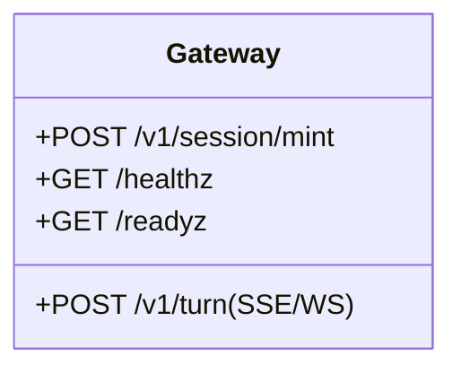
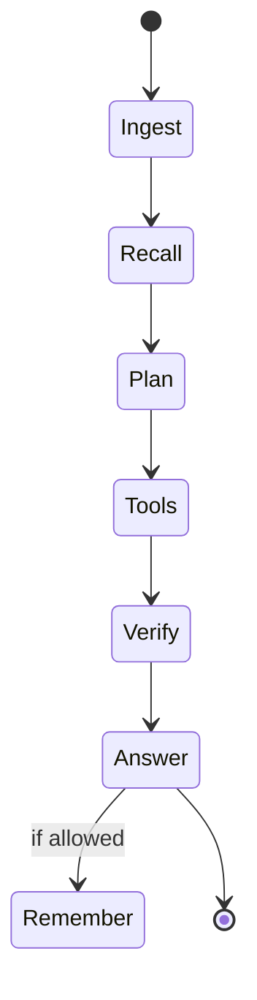
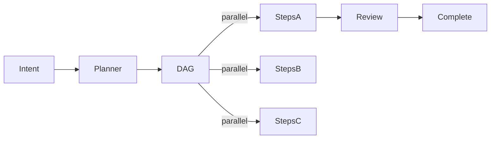
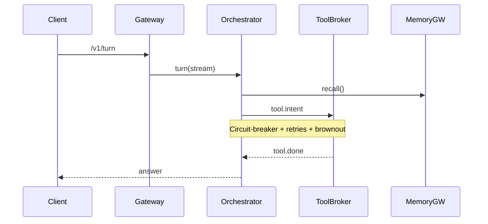
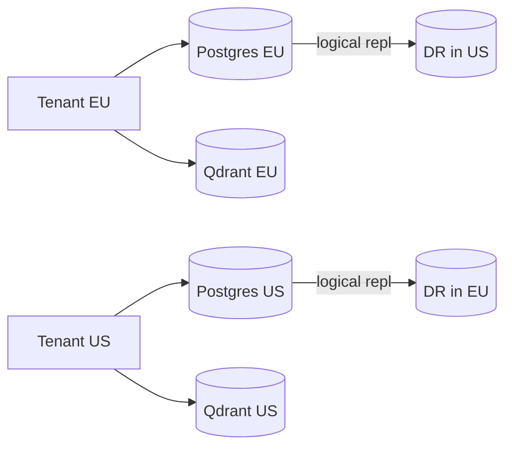

⚠️ WE DO NOT MOCK we DO NOT IMITATE, WE DO NOT USE BYPASSES OR GIVE FAKE OR UNREAL VALUES TO PAST TESTS, we use MATH perfect math TO surpass any problem and we only abide truth and real serveres real data. Sabe this EVERYWHRE at the start of every Document!

# 09 — Roadmap & Team Plan

## Phases
- **A) Spine (2–4 wks)**: Edge + Core + Memory Recall + Events + Dashboards
- **B) Durable & Safe (3–5 wks)**: Temporal Jobs + Remember + Admission + Billing
- **C) Marketplace Alpha (3–5 wks)**: publish/install/update/revoke + perf ranking
- **D) Global Scale**: multi-region; QoS lanes; DR drills

## Team Roles
- Platform (K8s/mesh/observability)
- Core Services (Gateway, Orchestrator, Tool Broker, Memory)
- Data (Postgres/Kafka/ClickHouse)
- Security (SPIRE/OPA/Vault)
- Marketplace & Billing
- SRE (runbooks, alerts, DR)


# 07 — Security & Policy

- SPIRE SVIDs + mesh mTLS
- Cosign + in-toto + SBOM scan
- OPA Gatekeeper + allow-list egress
- Vault for secrets; dynamic DB creds; envelope encryption
- PII hashing; retention; audit with `trace_id`


# 06 — Math (Routing, Scaling, Scheduling)

## Conductance Autoscaling
\(C_e \leftarrow (1-\beta\Delta t)C_e + \alpha\Delta t \cdot EMA_\tau(|f_e|)\)

## Potential Routing
Solve \(L\phi=b\) and route turns along \(-\nabla \phi\).

## Queue Sizing
M/M/k with \(\rho\le 0.7\); P95 bound via Erlang-C; brownout if exceeded.

## Min-Cost Assignment
Costs = latency + risk + budget weight; capacities per tool QPS.


# 05 — Data Model (DDL snippets)

```sql
CREATE TABLE tenants(
  id UUID PRIMARY KEY,
  name TEXT NOT NULL,
  plan TEXT NOT NULL,
  limits JSONB NOT NULL,
  billing_profile JSONB NOT NULL,
  residency TEXT NOT NULL,
  created_at TIMESTAMPTZ DEFAULT now()
);
CREATE TABLE usage_ledger(
  tenant UUID NOT NULL,
  agent TEXT NOT NULL,
  session UUID NOT NULL,
  tokens BIGINT NOT NULL,
  tool_calls INT NOT NULL,
  storage_bytes BIGINT NOT NULL,
  egress_bytes BIGINT NOT NULL,
  cost_cents BIGINT NOT NULL,
  ts_minute TIMESTAMPTZ NOT NULL
);
CREATE INDEX ix_ledger_tenant_minute ON usage_ledger(tenant, ts_minute);
```

Redis keys:  
- `sess:{session}` → budgets snapshot (TTL=15m)  
- `rate:{tenant}:{tool}` → sliding-window counters  
- `idem:{tool}:{key}` → idempotency (TTL=24h)


# 04 — Public APIs (excerpts)

## POST /v1/session/mint
Request:
```json
{"tenant":"uuid","persona_hash":"sha256-..","policy_hash":"sha256-..","budgets":{"tokens":100000,"tools_per_min":60}}
```
Response:
```json
{"jwt":"eyJ...","expires_in":900}
```

## POST /v1/turn  (stream)
Request:
```json
{"session_id":"uuid","inputs":{"text":"Ship a changelog"}, "allow":{"tools":["github","slack"],"memory":"readwrite"}}
```
Stream events: `plan` | `tool.delta` | `verify` | `answer`

## Memory
- `/v1/memory/recall` → `[{evidence_block}]`
- `/v1/memory/remember` → gated write

## Jobs (Temporal)
- `/v1/jobs` create; `/v1/jobs/:id` status/logs

## Marketplace
- `/v1/agents/publish|install|update|revoke`


# 03 — Services (Detailed)

## Gateway API
- AuthN/Z, rate limits, region pinning, token mint with budgets.
- Emits `gateway.audit`.



## Orchestrator
- Turn loop: Recall → Plan → Tools → Verify → Answer → Remember?
- Enforces persona/policy; emits `conversation.events`, `billing.usage`.



## Multi-Agent Orchestrator (MAO)
- Temporal workflows; DAGs from Capsules; approvals + SAGA.



## Tool Broker
- JSON Schema validation; allow-lists; rate/budget gates; sandboxed exec; `tool.delta`/`tool.done`.

## Memory Gateway
- Qdrant + JSON facts; evidence shaping; remember-guard and provenance.


# 02 — System Architecture (Mermaid)

## Topology
```mermaid
flowchart TB
  subgraph Edge
    Gateway[Gateway API]:::svc
    IAM[Identity & Access]:::svc
  end
  subgraph Core
    Orchestrator:::svc
    MAO[Multi-Agent Orchestrator (Temporal)]:::svc
    ToolBroker:::svc
    MemoryGW[Memory Gateway]:::svc
    Market[Marketplace API]:::svc
    Billing[Billing & Ledger]:::svc
  end
  subgraph Data
    PG[(Postgres)]:::db
    R[(Redis)]:::db
    K[(Kafka)]:::bus
    CH[(ClickHouse)]:::db
    S3[(MinIO/S3)]:::obj
    VDB[(Qdrant)]:::db
  end
  Client-->Gateway
  Gateway-->Orchestrator
  Orchestrator-->MemoryGW
  Orchestrator-->ToolBroker
  Orchestrator-->MAO
  MAO-->K
  ToolBroker-->K
  Orchestrator-->K
  Market-->PG
  Billing-->CH
  MemoryGW-->VDB
  classDef svc fill:#eef,stroke:#66f,stroke-width:1px;
  classDef db fill:#efe,stroke:#282,stroke-width:1px;
  classDef bus fill:#fee,stroke:#a22,stroke-width:1px;
  classDef obj fill:#ffd,stroke:#aa0,stroke-width:1px;
```

## Failure Containment


## Data Residency Model



# 01 — Context and Goals

## Purpose
Align the team on exact outcomes, audiences, and constraints.

## Audiences
- Builders (agent authors), Operators (SRE/SecOps), Tenants (org admins), End users (humans/agents).

## Business Outcomes
- Time-to-first-test < 5 minutes.
- Predictable spend via usage metering & budgets.
- Marketplace-driven growth with safe distribution.

## KPIs
- Turn P95, Tool P95, Recall P95
- Spend per tenant, error budgets, policy denials (accepted vs false positives)
- Marketplace conversion and SLA credits issued


# Tone & Writing Guide

- Be precise: name metrics and targets.
- Cite policies and hashes; never hand‑wave.
- Avoid anthropomorphism; agents are **software** with scopes and budgets.
- Prefer “prove” over “assume”: link to traces, events, or dashboards.

## Sprint Breakdown (8 sprints, ~2 weeks each)

- **Sprint 1 (Weeks 0‑2)** – Foundations & Dev Setup
  - Repo scaffolding, CI pipeline, Docker‑compose stack (Kafka, Redis, Postgres, Qdrant).
  - Basic **Gateway API** (JWT mint, health checks) and **Memory‑Recall** prototype (≤ 120 ms).
  - Initial observability: Prometheus metrics, SomaSuite dashboards for latency & token usage.
  - Team focus: Platform + Core Services.

- **Sprint 2 (Weeks 2‑4)** – Core Orchestration & Eventing
  - Implement **Orchestrator** turn loop, streaming SSE/WS, provenance tagging.
  - Event bus (Kafka) integration, `gateway.audit` and `conversation.events` topics.
  - Dashboard extensions for turn‑latency and event rates.
  - Team focus: Core Services + Platform.

- **Sprint 3 (Weeks 4‑6)** – Governance & Policy Engine
  - Build **Constitution Service** with Cosign/SBOM verification.
  - Deploy **OPA Gatekeeper** policies; integrate with Orchestrator for admission checks.
  - Add **PII hashing**, retention, and audit `trace_id` handling.
  - Team focus: Security + Core Services.

- **Sprint 4 (Weeks 6‑8)** – Durable Jobs & Billing Ledger
  - Deploy **Temporal** cluster; create job workflow schema.
  - Implement **Remember Service** (write‑through to Qdrant) with budget gating.
  - Design **usage_ledger** schema, ClickHouse aggregation, OpenMeter/Lago pricing hooks.
  - Team focus: Data + Core Services.

- **Sprint 5 (Weeks 8‑10)** – Marketplace Alpha & Tool Broker
  - Build **Marketplace API**: publish, install, update, revoke endpoints.
  - Add **Tool Broker** sandbox (Docker/Firecracker), JSON‑schema validation, streaming `tool.delta` events.
  - Performance ranking logic for capsules.
  - Team focus: Marketplace & Billing + Security.

- **Sprint 6 (Weeks 10‑12)** – Global Scale Foundations
  - Terraform/Helm scripts for multi‑region (EU/US) deployments.
  - Implement **QoS lanes**, token‑budget throttling, brown‑out policies.
  - Create **DR drill** capsule and runbooks; test failover across regions.
  - Team focus: Platform + SRE.

- **Sprint 7 (Weeks 12‑14)** – Advanced Math & Autoscaling
  - Implement **Conductance Autoscaling**, **Potential Routing**, and **Min‑Cost Assignment** algorithms.
  - Integrate queue‑sizing (M/M/k) with Erlang‑C P95 guarantees.
  - Refine token‑estimator service for predictive budgeting.
  - Team focus: Core Services + Security.

- **Sprint 8 (Weeks 14‑16)** – KAMACHIQ Mode Prototype & Release Prep
  - End‑to‑end **KAMACHIQ** planner capsule: generate project DAGs from roadmaps.
  - Full **zero‑trust** mTLS mesh across services, final Vault secret rotation.
  - Documentation, final acceptance tests, release checklist, and launch readiness.
  - Team focus: All teams for final polish and hand‑off.


# SomaBrain Overview (Memory & Reasoning Engine)

SomaBrain is the **deterministic, math‑powered memory and reasoning engine** that backs the Memory Gateway in SomaGent.  It provides:

- **Fast, provenance‑rich recall** – sub‑120 ms latency, full audit trail (`trace_id`) for every retrieved fact.
- **Hyperdimensional embeddings (HRR/Quantum)** – 8 k‑dim vectors, FFT bind/unbind, Wiener unbinding, and unit‑norm guarantees.
- **Density‑matrix (`ρ`) scoring** – robust superposition recall with calibrated confidence scores.
- **Transport & conductance (FRGO)** – sparse flow optimisation that reshapes the memory graph based on usage, reducing effective resistance and material cost.
- **Planner / Context bundles** – `/v1/brain/evaluate` and `/v1/brain/feedback` endpoints expose a reasoning loop that builds a `ContextBundle` (memories, policy directives, prompts) for the orchestrator.
- **Adaptive tuning** – online convex optimisation of utility weights (λ, μ, ν, α, β, γ, τ) with safe rollback when constitutional bounds are exceeded.
- **Zero‑trust governance** – constitution stored in Redis/Postgres with threshold‑signing (Ed25519 shards) verified via Cosign; OPA policies enforce egress allow‑lists.
- **Observability** – OpenTelemetry traces, Prometheus metrics, and audit events (`somabrain_constitution_verify_latency_seconds`, `somabrain_audit_fallback_total`).
- **Configuration** – environment variables and config files for JWT auth, rate limits, advanced math modules, and deployment via the canonical Docker stack (`Docker_Canonical.yml`).

The **SomaBrain canonical roadmap** (sprints S0‑S10) aligns with SomaGent’s phases:
- **Spine (A)** consumes the *Memory Fabric* (S3) and *Context Bundles* (S4).
- **Durable & Safe (B)** adds *Constitution Cloud* (S1) and *Audit* (S2) services.
- **Marketplace Alpha (C)** leverages the *Planner Loop* (S4) and *Agent RPC* (S4) for capsule execution.
- **Global Scale (D)** builds on the *Observability & Telemetry Mesh* (S6) and *Identity & Secrets* (S7) to achieve multi‑region resilience.

**Key integration points for SomaGent**:
- `Memory Gateway` → calls `somabrain.memory_client` for `/recall` and `/remember`.
- `Orchestrator` → uses `somabrain.context.builder` to assemble `ContextBundle` before planning.
- `Billing` → records token usage via `somabrain.storage.token_ledger`.
- `Security` → constitution verification via `somabrain.constitution.cloud` and OPA enforcement.

For detailed design, see SomaBrain docs: `docs/architecture/DETAILED_ARCHITECTURE.md`, `docs/architecture/CANONICAL_ROADMAP.md`, and the `README.md` overview.

## Memory Capsules – Structured Knowledge Units

A **memory capsule** is a versioned, signed bundle that packages a coherent slice of knowledge (facts, embeddings, provenance) for consumption by agents via the **Memory Gateway**.  Capsules enable:

1. **Reusable Context** – agents can import a capsule once and repeatedly recall its contents without re‑learning.
2. **Policy‑driven Access** – each capsule carries a cryptographic hash and a policy payload that the **Constitution Service** validates before admission.
3. **Fine‑grained Billing** – usage of a capsule is tracked in `usage_ledger` (tokens, tool calls, storage) enabling per‑capsule invoicing.
4. **Cross‑tenant Isolation** – capsules are namespaced by tenant ID; the `rate:{tenant}:{capsule}` Redis counter enforces per‑tenant quotas.

### Capsule Structure (JSON/YAML)
```yaml
id: <uuid>
tenant: <tenant‑uuid>
version: 1
created_at: 2025-09-26T12:34:56Z
signature: <cosign‑ed25519‑sig>
policy_hash: <sha256‑policy>
memory_blocks:
  - type: episodic
    embedding: [0.12, -0.34, …]   # HRR vector (8k‑dim)
    metadata:
      timestamp: 2025-09-20T08:00:00Z
      source: "SOP‑001"
      importance: 0.9
  - type: factual
    embedding: [0.45, 0.22, …]
    metadata:
      description: "User‑profile for tenant X"
      tags: ["profile", "customer"]
```

*The `signature` is generated with **Cosign** using the tenant’s signing key‑shards.  The `policy_hash` points to a constitution entry that defines allowed egress, retention, and budget limits.*

### API Endpoints (Memory Service)
- `POST /v1/memory/capsule/upload` – upload a new capsule (multipart JSON/YAML + signature).  Returns capsule ID.
- `GET /v1/memory/capsule/{id}` – retrieve capsule metadata (no embedding payload unless authorized).
- `POST /v1/memory/recall` – query can reference a capsule ID to limit the search space (`capsule_ids: ["uuid1", "uuid2"]`).
- `DELETE /v1/memory/capsule/{id}` – revokes a capsule (requires admin role and constitution update).

All endpoints enforce **mTLS** (SPIRE) and **OPA** egress policies; audit events (`memory.capsule.upload`, `memory.capsule.recall`) are emitted to Kafka for downstream billing and compliance.

### Integration Flow with the Agent Server
1. **Agent Server** requests a session token from **Gateway API** (`/v1/session/mint`).  The token encodes allowed capsule IDs in its `allow` claim.
2. During a turn, the **Orchestrator** builds a `ContextBundle` by calling `POST /v1/memory/recall` with the capsule IDs from the session token.
3. The **Memory Gateway** resolves the request against the **SomaBrain** vector store, returning ranked evidence blocks with provenance (`trace_id`).
4. The **Orchestrator** includes the retrieved evidence in the prompt sent to the LLM, preserving the capsule provenance for audit.
5. Usage (tokens, storage, capsule reads) is logged to `usage_ledger` and billed according to the capsule’s SKU.

### Lifecycle & Governance
- **Creation** – author writes memory blocks, runs `somabrain/tools/packager.py` to generate the capsule, signs with Cosign, and publishes via `/v1/memory/capsule/upload`.
- **Review** – a governance pipeline validates the policy hash, runs static analysis (SBOM), and stores the capsule in the **Marketplace** for discovery.
- **Update** – new version increments `version` field; old versions remain immutable for audit.
- **Retirement** – admin revokes via `/v1/memory/capsule/{id}`; downstream agents receive a `memory.capsule.revoked` event and stop using it.

### Alignment with SomaGent Roadmap
- **Spine (Phase A)** – Memory‑Recall service consumes capsule embeddings for sub‑120 ms queries.
- **Durable & Safe (Phase B)** – Constitution validation and billing ledger integrate capsule lifecycle.
- **Marketplace Alpha (Phase C)** – Capsules are listed as marketplace assets; performance ranking uses capsule‑level latency metrics.
- **Global Scale (Phase D)** – Capsules are replicated across regions (EU/US) via the **Data Residency Model** diagram; DR drills verify capsule availability.

For deeper design, see the **Memory Gateway** section in `docs/02_System_Architecture.md` and the **Capsule Builder** UI prototype in `docs/design/`.
