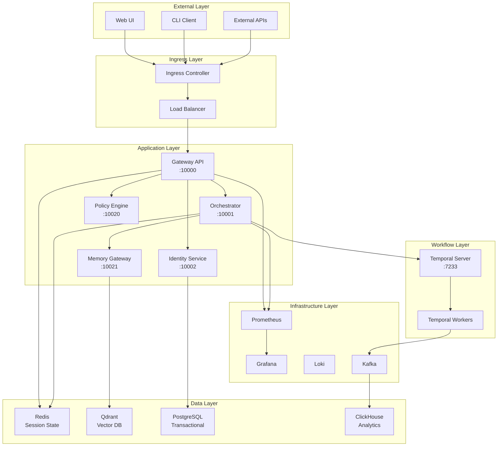
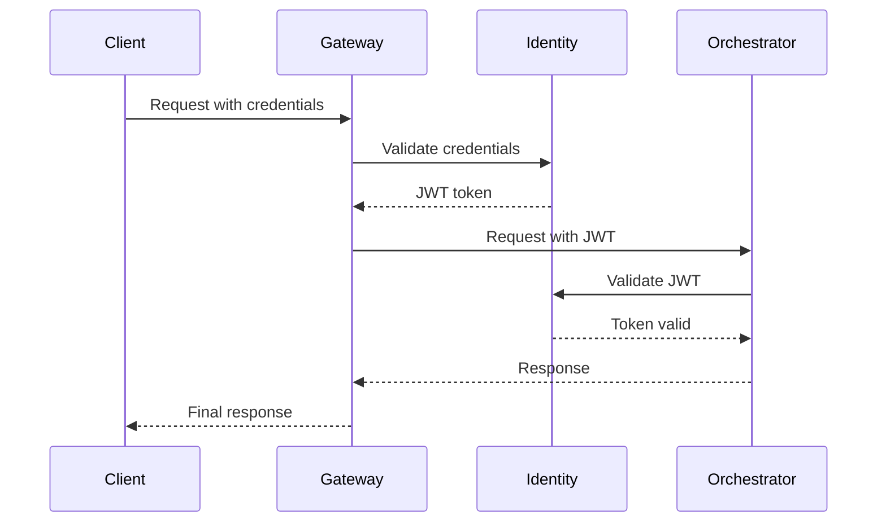

# System Architecture


## Overview

SomaAgentHub implements a microservices architecture designed for enterprise-scale agent orchestration with production-ready infrastructure, comprehensive observability, and policy-driven governance.

## High-Level Architecture



## Core Services Architecture

### Gateway API Service
**Port**: 10000 (external), 8000 (container)
**Purpose**: Public ingress and wizard flow orchestration

**Components**:
- FastAPI application with async request handling
- Redis-based session management
- WebSocket support for real-time updates
- Middleware for authentication and context propagation

**Key Files**:
- `services/gateway-api/app/main.py` - Application entry point
- `services/gateway-api/app/api/routes.py` - REST endpoints
- `services/gateway-api/app/core/redis.py` - Redis client management
- `services/gateway-api/app/wizard_engine.py` - Wizard flow logic

**Dependencies**:
```python
# External dependencies
redis >= 4.0.0
fastapi >= 0.100.0
uvicorn >= 0.20.0

# Internal dependencies
orchestrator (10001)
identity-service (10002)
pricing-service (10026) # optional
```

### Orchestrator Service
**Port**: 10001 (external), 8000 (container)
**Purpose**: Temporal workflow coordination and agent lifecycle management

**Components**:
- Temporal client integration
- Workflow and activity definitions
- Session state synchronization
- Policy enforcement integration

**Key Files**:
- `services/orchestrator/app/main.py` - FastAPI application
- `services/orchestrator/app/workflows/` - Temporal workflows
- `services/orchestrator/temporal_worker.py` - Temporal worker process
- `services/orchestrator/app/core/config.py` - Configuration management

**Temporal Integration**:
```python
# Workflow definition
@workflow.defn
class AgentSessionWorkflow:
    @workflow.run
    async def run(self, session_request: SessionRequest) -> SessionResult:
        # Policy check activity
        policy_result = await workflow.execute_activity(
            check_policy,
            session_request.action,
            start_to_close_timeout=timedelta(seconds=30)
        )
        
        if not policy_result.allowed:
            return SessionResult(status="blocked", reason=policy_result.reason)
        
        # Execute agent tasks
        return await workflow.execute_activity(
            execute_agent_tasks,
            session_request,
            start_to_close_timeout=timedelta(minutes=10)
        )
```

### Identity Service
**Port**: 10002 (external), 8000 (container)
**Purpose**: Authentication, authorization, and token management

**Components**:
- JWT token issuance and validation
- User and service account management
- RBAC policy enforcement
- Optional SPIFFE/SPIRE integration

**Key Files**:
- `services/identity-service/app/main.py` - Service entry point
- `services/identity-service/app/auth.py` - Authentication logic
- `services/identity-service/app/models.py` - Data models

**Token Flow**:
```python
# Token issuance
@app.post("/v1/tokens/issue")
async def issue_token(request: TokenRequest) -> TokenResponse:
    # Validate credentials
    user = await authenticate_user(request.username, request.password)
    
    # Generate JWT
    token = jwt.encode({
        "sub": user.id,
        "iat": datetime.utcnow(),
        "exp": datetime.utcnow() + timedelta(hours=24),
        "scopes": user.scopes
    }, JWT_SECRET, algorithm="HS256")
    
    return TokenResponse(access_token=token, token_type="bearer")
```

### Memory Gateway
**Port**: 10021 (external), 8000 (container)
**Purpose**: Vector and key-value storage for agent memory

**Components**:
- Qdrant vector database integration
- Redis key-value storage
- Semantic search capabilities
- Memory lifecycle management

**Key Files**:
- `services/memory-gateway/app/main.py` - Service application
- `services/memory-gateway/app/vector_store.py` - Qdrant integration
- `services/memory-gateway/app/kv_store.py` - Redis integration

**Memory Operations**:
```python
# Vector storage
@app.post("/collections/{collection}/points")
async def store_vectors(
    collection: str,
    points: List[VectorPoint]
) -> StorageResponse:
    # Store in Qdrant
    result = await qdrant_client.upsert(
        collection_name=collection,
        points=[
            PointStruct(
                id=point.id,
                vector=point.vector,
                payload=point.payload
            ) for point in points
        ]
    )
    
    # Cache metadata in Redis
    for point in points:
        await redis_client.hset(
            f"vector:{collection}:{point.id}",
            mapping=point.payload
        )
    
    return StorageResponse(stored=len(points))
```

### Policy Engine
**Port**: 10020 (external), 8000 (container)
**Purpose**: Rule-based governance and compliance enforcement

**Components**:
- Open Policy Agent (OPA) integration
- Policy rule evaluation
- Decision logging and audit
- Constitution service integration

**Key Files**:
- `services/policy-engine/app/main.py` - Policy service
- `services/policy-engine/policies/` - Rego policy files
- `services/policy-engine/app/opa_client.py` - OPA integration

**Policy Evaluation**:
```python
# Policy decision
@app.post("/v1/evaluate")
async def evaluate_policy(request: PolicyRequest) -> PolicyDecision:
    # Prepare OPA input
    opa_input = {
        "user": request.user,
        "action": request.action,
        "resource": request.resource,
        "context": request.context
    }
    
    # Query OPA
    result = await opa_client.query("data.agent.policies.allow", opa_input)
    
    # Log decision
    await audit_logger.log_decision(request, result)
    
    return PolicyDecision(
        allowed=result.get("allow", False),
        reason=result.get("reason", "Policy evaluation"),
        decision_id=generate_decision_id()
    )
```

## Supporting Services

### Analytics Service
**Purpose**: Metrics collection and business intelligence

**Components**:
- Kafka event consumption
- ClickHouse data warehouse
- Real-time analytics processing
- Prometheus metrics export

### Tool Service
**Purpose**: External tool integration and adapter management

**Components**:
- Tool adapter registry
- Dynamic adapter loading
- Tool execution sandboxing
- Result caching and validation

### Billing Service
**Purpose**: Usage tracking and cost management

**Components**:
- Resource consumption tracking
- Cost calculation engine
- Budget enforcement
- Usage reporting

## Data Architecture

### Session State (Redis)
```
session:{session_id} -> {
    "user_id": "user_123",
    "workflow_id": "wf_abc",
    "status": "active",
    "context": {...},
    "created_at": "2024-12-19T10:00:00Z"
}

agent:{agent_id}:context -> {
    "memory_keys": [...],
    "tool_state": {...},
    "last_action": "..."
}
```

### Vector Memory (Qdrant)
```
Collection: session_{session_id}
Points: [
    {
        "id": "mem_001",
        "vector": [0.1, 0.2, ...],  # 1536 dimensions
        "payload": {
            "type": "conversation",
            "timestamp": "2024-12-19T10:00:00Z",
            "content": "User asked about...",
            "agent_id": "agent_123"
        }
    }
]
```

### Transactional Data (PostgreSQL)
```sql
-- Users and authentication
CREATE TABLE users (
    id UUID PRIMARY KEY,
    username VARCHAR(255) UNIQUE,
    email VARCHAR(255),
    created_at TIMESTAMP DEFAULT NOW()
);

-- Agent definitions
CREATE TABLE agents (
    id UUID PRIMARY KEY,
    name VARCHAR(255),
    config JSONB,
    created_by UUID REFERENCES users(id)
);

-- Workflow executions
CREATE TABLE workflow_executions (
    id UUID PRIMARY KEY,
    workflow_id VARCHAR(255),
    status VARCHAR(50),
    started_at TIMESTAMP,
    completed_at TIMESTAMP,
    result JSONB
);
```

### Analytics Data (ClickHouse)
```sql
-- Agent performance metrics
CREATE TABLE agent_metrics (
    timestamp DateTime64,
    agent_id String,
    session_id String,
    action_type String,
    duration_ms UInt32,
    success Bool,
    error_message Nullable(String),
    metadata String  -- JSON
) ENGINE = MergeTree()
ORDER BY (timestamp, agent_id);

-- Workflow analytics
CREATE TABLE workflow_analytics (
    timestamp DateTime64,
    workflow_id String,
    step_name String,
    execution_time_ms UInt32,
    memory_usage_mb UInt32,
    cpu_usage_percent Float32
) ENGINE = MergeTree()
ORDER BY (timestamp, workflow_id);
```

## Network Architecture

### Service Mesh (Optional)
```yaml
# Istio service mesh configuration
apiVersion: networking.istio.io/v1beta1
kind: VirtualService
metadata:
  name: gateway-api
spec:
  hosts:
  - gateway-api
  http:
  - match:
    - uri:
        prefix: "/v1/"
    route:
    - destination:
        host: gateway-api
        port:
          number: 8000
    timeout: 30s
    retries:
      attempts: 3
```

### Network Policies
```yaml
# Restrict gateway access
apiVersion: networking.k8s.io/v1
kind: NetworkPolicy
metadata:
  name: gateway-api-policy
spec:
  podSelector:
    matchLabels:
      app: gateway-api
  policyTypes:
  - Ingress
  - Egress
  ingress:
  - from:
    - namespaceSelector:
        matchLabels:
          name: ingress-nginx
  egress:
  - to:
    - podSelector:
        matchLabels:
          app: orchestrator
    ports:
    - protocol: TCP
      port: 8000
```

## Security Architecture

### Authentication Flow


### RBAC Configuration
```yaml
# Service account for orchestrator
apiVersion: v1
kind: ServiceAccount
metadata:
  name: orchestrator
  namespace: soma-agent-hub

---
# Role for orchestrator permissions
apiVersion: rbac.authorization.k8s.io/v1
kind: Role
metadata:
  name: orchestrator-role
rules:
- apiGroups: [""]
  resources: ["pods", "configmaps", "secrets"]
  verbs: ["get", "list", "create", "update"]
- apiGroups: ["batch"]
  resources: ["jobs"]
  verbs: ["create", "get", "list", "delete"]

---
# Bind role to service account
apiVersion: rbac.authorization.k8s.io/v1
kind: RoleBinding
metadata:
  name: orchestrator-binding
subjects:
- kind: ServiceAccount
  name: orchestrator
roleRef:
  kind: Role
  name: orchestrator-role
  apiGroup: rbac.authorization.k8s.io
```

## Deployment Architecture

### Kubernetes Resources
```yaml
# Gateway API deployment
apiVersion: apps/v1
kind: Deployment
metadata:
  name: gateway-api
spec:
  replicas: 3
  selector:
    matchLabels:
      app: gateway-api
  template:
    metadata:
      labels:
        app: gateway-api
    spec:
      serviceAccountName: gateway-api
      containers:
      - name: gateway-api
        image: somaagent/gateway-api:latest
        ports:
        - containerPort: 8000
        env:
        - name: REDIS_URL
          value: "redis://redis:6379/0"
        - name: ORCHESTRATOR_URL
          value: "http://orchestrator:8000"
        livenessProbe:
          httpGet:
            path: /health
            port: 8000
          initialDelaySeconds: 30
        readinessProbe:
          httpGet:
            path: /ready
            port: 8000
          initialDelaySeconds: 5
        resources:
          requests:
            cpu: 500m
            memory: 512Mi
          limits:
            cpu: 1000m
            memory: 1Gi
```

### Helm Chart Structure
```
k8s/helm/soma-agent/
├── Chart.yaml
├── values.yaml
├── values-dev.yaml
├── values-production.yaml
└── templates/
    ├── gateway-api.yaml
    ├── orchestrator.yaml
    ├── identity-service.yaml
    ├── memory-gateway.yaml
    ├── policy-engine.yaml
    ├── configmaps.yaml
    ├── secrets.yaml
    └── servicemonitors.yaml
```

## Observability Architecture

### Metrics Collection
```python
# Prometheus metrics in services
from prometheus_client import Counter, Histogram, Gauge

# Request metrics
request_count = Counter(
    'http_requests_total',
    'Total HTTP requests',
    ['method', 'endpoint', 'status']
)

request_duration = Histogram(
    'http_request_duration_seconds',
    'HTTP request duration',
    ['method', 'endpoint']
)

# Business metrics
active_sessions = Gauge(
    'active_sessions_total',
    'Number of active agent sessions'
)

workflow_executions = Counter(
    'workflow_executions_total',
    'Total workflow executions',
    ['workflow_type', 'status']
)
```

### Distributed Tracing
```python
# OpenTelemetry integration
from opentelemetry import trace
from opentelemetry.exporter.otlp.proto.grpc.trace_exporter import OTLPSpanExporter
from opentelemetry.sdk.trace import TracerProvider
from opentelemetry.sdk.trace.export import BatchSpanProcessor

# Configure tracing
trace.set_tracer_provider(TracerProvider())
tracer = trace.get_tracer(__name__)

otlp_exporter = OTLPSpanExporter(endpoint="http://jaeger:14250")
span_processor = BatchSpanProcessor(otlp_exporter)
trace.get_tracer_provider().add_span_processor(span_processor)

# Trace workflow execution
@tracer.start_as_current_span("execute_workflow")
async def execute_workflow(session_id: str):
    with tracer.start_as_current_span("policy_check") as span:
        span.set_attribute("session.id", session_id)
        policy_result = await check_policy(session_id)
    
    with tracer.start_as_current_span("agent_execution"):
        return await execute_agents(session_id)
```

## Scalability Considerations

### Horizontal Scaling
- **Stateless Services**: Gateway, Orchestrator, Policy Engine scale horizontally
- **Database Scaling**: Read replicas for PostgreSQL, Redis clustering
- **Temporal Scaling**: Multiple worker pools, partitioned task queues
- **Vector Database**: Qdrant clustering for large-scale memory storage

### Performance Optimization
- **Connection Pooling**: Async database connections with pooling
- **Caching**: Redis caching for policy decisions and user sessions
- **Batch Processing**: Bulk operations for analytics and memory storage
- **Async Processing**: Non-blocking I/O throughout the stack

### Resource Management
```yaml
# Resource quotas per namespace
apiVersion: v1
kind: ResourceQuota
metadata:
  name: soma-agent-hub-quota
spec:
  hard:
    requests.cpu: "10"
    requests.memory: 20Gi
    limits.cpu: "20"
    limits.memory: 40Gi
    persistentvolumeclaims: "10"
```