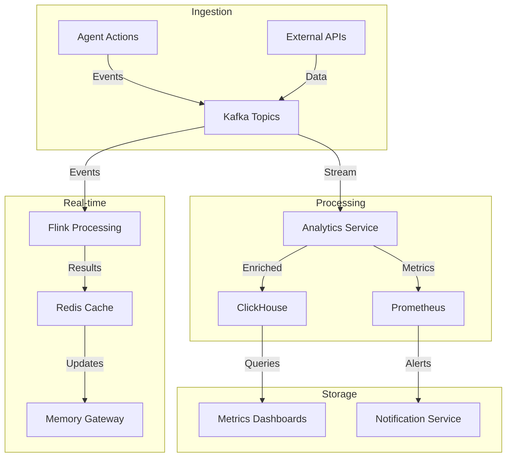

# Agent Data Pipeline


## Overview

SomaAgentHub provides a comprehensive data pipeline for agent workflows, enabling real-time data processing, analytics, and observability across the platform.

## Architecture



## Components

### Analytics Service
**Port**: Internal service
**Purpose**: Collects and processes agent execution metrics

**Features**:
- Real-time event processing from Kafka streams
- Metric aggregation and enrichment
- ClickHouse integration for time-series storage
- Prometheus metrics export

### Kafka Integration
**Configuration**: `KAFKA_BOOTSTRAP_SERVERS`
**Topics**:
- `agent.actions` - Agent task executions
- `workflow.events` - Temporal workflow state changes
- `policy.decisions` - Policy engine evaluations

### ClickHouse Analytics
**Ports**: 9000 (native), 8123 (HTTP)
**Purpose**: Time-series analytics database

**Schema**:
```sql
CREATE TABLE agent_metrics (
    timestamp DateTime64,
    agent_id String,
    workflow_id String,
    action_type String,
    duration_ms UInt32,
    success Bool,
    error_message Nullable(String)
) ENGINE = MergeTree()
ORDER BY (timestamp, agent_id);
```

### Flink Stream Processing
**Port**: 8082 (dashboard)
**Purpose**: Real-time stream processing

**Jobs**:
- Agent performance monitoring
- Anomaly detection
- Real-time aggregations

## Data Flow

### 1. Event Ingestion
```python
# Agent action triggers event
{
    "timestamp": "2024-12-19T10:00:00Z",
    "agent_id": "agent_001",
    "workflow_id": "wf_abc123",
    "action_type": "tool_execution",
    "tool_name": "web_scraper",
    "duration_ms": 1500,
    "success": true,
    "metadata": {
        "url": "https://example.com",
        "status_code": 200
    }
}
```

### 2. Stream Processing
```python
# Flink job processes events
def process_agent_event(event):
    # Calculate running averages
    avg_duration = calculate_moving_average(event.duration_ms)
    
    # Detect anomalies
    if event.duration_ms > avg_duration * 3:
        send_alert(f"Slow execution detected: {event.agent_id}")
    
    # Update real-time metrics
    update_redis_metrics(event.agent_id, {
        "last_execution": event.timestamp,
        "avg_duration": avg_duration,
        "success_rate": calculate_success_rate(event.agent_id)
    })
```

### 3. Analytics Storage
```sql
-- Query agent performance trends
SELECT 
    agent_id,
    toStartOfHour(timestamp) as hour,
    avg(duration_ms) as avg_duration,
    sum(success) / count(*) as success_rate
FROM agent_metrics 
WHERE timestamp >= now() - INTERVAL 24 HOUR
GROUP BY agent_id, hour
ORDER BY hour DESC;
```

## Configuration

### Analytics Service
```yaml
# Environment variables
KAFKA_BOOTSTRAP_SERVERS: "kafka:9092"
CLICKHOUSE_HOST: "clickhouse"
CLICKHOUSE_PORT: "9000"
REDIS_URL: "redis://redis:6379/1"
PROMETHEUS_GATEWAY: "pushgateway:9091"
```

### Kafka Topics
```bash
# Create required topics
kafka-topics --create --topic agent.actions --partitions 3 --replication-factor 1
kafka-topics --create --topic workflow.events --partitions 3 --replication-factor 1
kafka-topics --create --topic policy.decisions --partitions 1 --replication-factor 1
```

### ClickHouse Setup
```bash
# Initialize schema
make init-clickhouse LOAD_SAMPLE_DATA=true

# Run migrations
make run-migrations
```

## Usage Examples

### Query Agent Performance
```python
from services.analytics_service.app.client import AnalyticsClient

client = AnalyticsClient()

# Get agent performance metrics
metrics = client.get_agent_metrics(
    agent_id="agent_001",
    start_time="2024-12-19T00:00:00Z",
    end_time="2024-12-19T23:59:59Z"
)

print(f"Average duration: {metrics.avg_duration_ms}ms")
print(f"Success rate: {metrics.success_rate * 100}%")
```

### Real-time Monitoring
```python
# Subscribe to real-time metrics
def on_metric_update(agent_id, metrics):
    if metrics.success_rate < 0.8:
        alert_manager.send_alert(
            f"Agent {agent_id} success rate below 80%"
        )

client.subscribe_to_metrics(on_metric_update)
```

### Custom Analytics
```sql
-- Find slowest agent operations
SELECT 
    agent_id,
    action_type,
    percentile(duration_ms, 0.95) as p95_duration
FROM agent_metrics 
WHERE timestamp >= now() - INTERVAL 1 HOUR
GROUP BY agent_id, action_type
HAVING p95_duration > 5000
ORDER BY p95_duration DESC;
```

## Monitoring & Alerts

### Metrics Dashboards
- Agent Performance Overview
- Workflow Execution Trends
- Error Rate Analysis
- Resource Utilization

### Prometheus Metrics
```
# Agent execution metrics
agent_execution_duration_seconds{agent_id, action_type}
agent_execution_total{agent_id, action_type, status}
agent_memory_usage_bytes{agent_id}

# Workflow metrics
workflow_duration_seconds{workflow_id, status}
workflow_step_count{workflow_id}
```

### Alerting Rules
```yaml
groups:
- name: agent_performance
  rules:
  - alert: HighAgentErrorRate
    expr: rate(agent_execution_total{status="error"}[5m]) > 0.1
    for: 2m
    labels:
      severity: warning
    annotations:
      summary: "High error rate for agent {{ $labels.agent_id }}"
```

## Troubleshooting

### Data Pipeline Issues
```bash
# Check Kafka connectivity
kubectl exec -it kafka-0 -- kafka-console-consumer --topic agent.actions --bootstrap-server localhost:9092

# Verify ClickHouse ingestion
kubectl exec -it clickhouse-0 -- clickhouse-client --query "SELECT count() FROM agent_metrics WHERE timestamp >= now() - INTERVAL 1 HOUR"

# Monitor Flink jobs
kubectl port-forward svc/flink-jobmanager 8082:8082
# Visit http://localhost:8082
```

### Performance Optimization
```bash
# Optimize ClickHouse queries
OPTIMIZE TABLE agent_metrics FINAL;

# Scale Kafka partitions
kafka-topics --alter --topic agent.actions --partitions 6

# Tune Flink parallelism
kubectl patch deployment flink-taskmanager -p '{"spec":{"replicas":3}}'
```