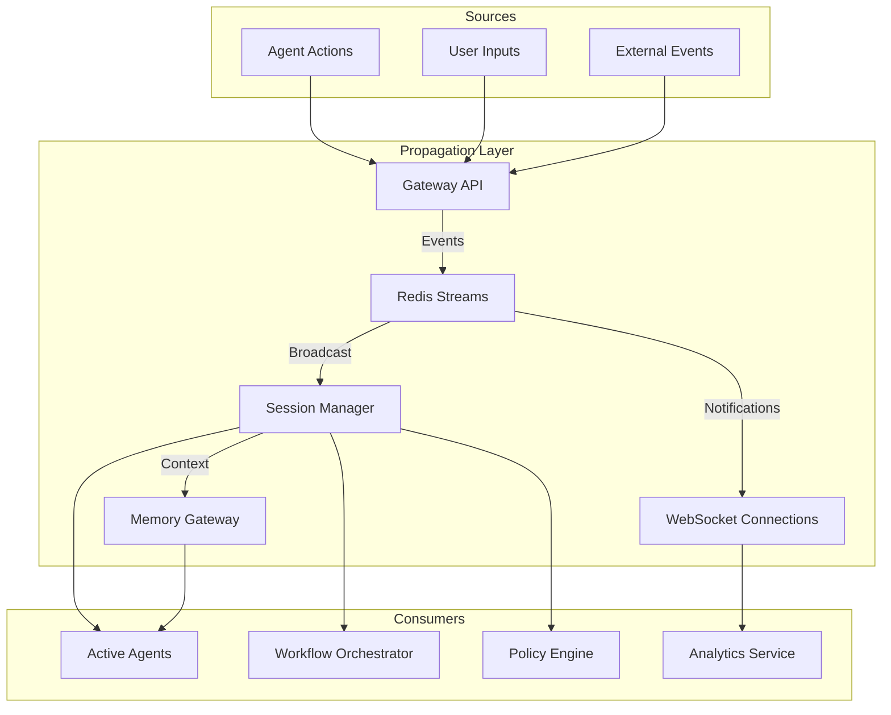

# Real-Time Agent Propagation


## Overview

SomaAgentHub's real-time propagation system enables instant context sharing, session synchronization, and event distribution across multiple agents and workflows.

## Architecture



## Components

### Redis Streams
**Purpose**: High-performance event streaming and message propagation
**Configuration**: `REDIS_URL`

**Stream Structure**:
```
agent:events:*     - Agent action events
session:updates:*  - Session state changes  
context:changes:*  - Memory context updates
policy:decisions:* - Policy evaluation results
```

### Session Manager
**Location**: `services/common/session/`
**Purpose**: Maintains session state and context propagation

**Features**:
- Real-time session synchronization
- Context inheritance between agents
- Session lifecycle management
- Cross-agent memory sharing

### Memory Gateway Integration
**Port**: 10021
**Purpose**: Vector and key-value storage with real-time updates

**Capabilities**:
- Instant context retrieval
- Semantic search propagation
- Memory invalidation events
- Context versioning

## Real-Time Features

### 1. Session Context Propagation

```python
# Automatic context sharing between agents
class SessionContext:
    def __init__(self, session_id: str):
        self.session_id = session_id
        self.redis_client = get_redis_client()
        
    def update_context(self, key: str, value: Any):
        # Update local context
        self.context[key] = value
        
        # Propagate to all session participants
        self.redis_client.xadd(
            f"session:updates:{self.session_id}",
            {
                "type": "context_update",
                "key": key,
                "value": json.dumps(value),
                "timestamp": datetime.utcnow().isoformat(),
                "agent_id": self.agent_id
            }
        )
        
    def subscribe_to_updates(self, callback):
        # Listen for context changes from other agents
        for message in self.redis_client.xread({
            f"session:updates:{self.session_id}": "$"
        }, block=0):
            callback(message)
```

### 2. Agent Event Broadcasting

```python
# Real-time agent action propagation
class AgentEventBroadcaster:
    def broadcast_action(self, agent_id: str, action: dict):
        event = {
            "agent_id": agent_id,
            "action_type": action["type"],
            "timestamp": datetime.utcnow().isoformat(),
            "data": action["data"],
            "session_id": action.get("session_id")
        }
        
        # Broadcast to all subscribers
        self.redis_client.xadd("agent:events:global", event)
        
        # Session-specific broadcast
        if session_id := event.get("session_id"):
            self.redis_client.xadd(f"agent:events:{session_id}", event)
            
        # Trigger memory updates
        if action["type"] in ["memory_store", "context_update"]:
            self.trigger_memory_propagation(event)
```

### 3. Policy Decision Propagation

```python
# Real-time policy enforcement
class PolicyPropagator:
    def propagate_decision(self, decision: PolicyDecision):
        # Broadcast policy decision
        self.redis_client.xadd("policy:decisions:global", {
            "decision_id": decision.id,
            "agent_id": decision.agent_id,
            "action": decision.action,
            "allowed": decision.allowed,
            "reason": decision.reason,
            "timestamp": decision.timestamp.isoformat()
        })
        
        # Update affected agents immediately
        if not decision.allowed:
            self.notify_agent_blocked(decision.agent_id, decision.reason)
```

## WebSocket Integration

### Real-Time Client Updates
```javascript
// Frontend WebSocket connection
const ws = new WebSocket('ws://localhost:10000/ws/session/sess_123');

ws.onmessage = function(event) {
    const update = JSON.parse(event.data);
    
    switch(update.type) {
        case 'agent_action':
            updateAgentStatus(update.agent_id, update.status);
            break;
        case 'context_change':
            refreshContextPanel(update.context);
            break;
        case 'policy_decision':
            showPolicyAlert(update.decision);
            break;
    }
};
```

### Gateway WebSocket Handler
```python
# Gateway API WebSocket endpoint
@app.websocket("/ws/session/{session_id}")
async def websocket_endpoint(websocket: WebSocket, session_id: str):
    await websocket.accept()
    
    # Subscribe to session events
    async for message in redis_client.xread({
        f"session:updates:{session_id}": "$",
        f"agent:events:{session_id}": "$"
    }):
        await websocket.send_json({
            "type": message["type"],
            "data": message["data"],
            "timestamp": message["timestamp"]
        })
```

## Memory Propagation

### Vector Context Updates
```python
# Automatic memory synchronization
class MemoryPropagator:
    def __init__(self, memory_gateway_url: str):
        self.memory_client = MemoryGatewayClient(memory_gateway_url)
        
    def propagate_memory_update(self, session_id: str, memory_data: dict):
        # Store in vector database
        vector_id = self.memory_client.store_vector(
            collection=f"session_{session_id}",
            vector=memory_data["embedding"],
            payload=memory_data["metadata"]
        )
        
        # Broadcast memory update event
        self.redis_client.xadd(f"context:changes:{session_id}", {
            "type": "memory_update",
            "vector_id": vector_id,
            "collection": f"session_{session_id}",
            "timestamp": datetime.utcnow().isoformat()
        })
        
        # Trigger context refresh for active agents
        self.notify_agents_memory_updated(session_id, vector_id)
```

## Configuration

### Redis Streams Setup
```yaml
# Redis configuration for streams
redis:
  maxmemory-policy: allkeys-lru
  stream-node-max-bytes: 4096
  stream-node-max-entries: 100
```

### Gateway API Configuration
```python
# WebSocket and propagation settings
WEBSOCKET_ENABLED = True
REDIS_STREAM_BLOCK_MS = 1000
MAX_STREAM_LENGTH = 10000
PROPAGATION_BATCH_SIZE = 100
```

### Memory Gateway Integration
```python
# Real-time memory sync settings
MEMORY_PROPAGATION_ENABLED = True
VECTOR_UPDATE_THRESHOLD = 0.1
CONTEXT_REFRESH_INTERVAL = 5  # seconds
```

## Usage Examples

### Subscribe to Agent Events
```python
# Monitor all agent actions in real-time
async def monitor_agent_actions():
    async for message in redis_client.xread({"agent:events:global": "$"}):
        agent_id = message["agent_id"]
        action_type = message["action_type"]
        
        print(f"Agent {agent_id} performed {action_type}")
        
        # React to specific actions
        if action_type == "error":
            await handle_agent_error(agent_id, message["data"])
```

### Cross-Agent Context Sharing
```python
# Share context between agents in same session
class MultiAgentSession:
    def share_context(self, from_agent: str, to_agent: str, context_key: str):
        # Get context from source agent
        context_value = self.get_agent_context(from_agent, context_key)
        
        # Propagate to target agent
        self.update_agent_context(to_agent, context_key, context_value)
        
        # Broadcast the sharing event
        self.broadcast_context_share(from_agent, to_agent, context_key)
```

### Real-Time Policy Enforcement
```python
# Immediate policy decision propagation
def enforce_policy_decision(agent_id: str, action: str, decision: bool):
    if not decision:
        # Immediately block agent action
        redis_client.xadd(f"agent:commands:{agent_id}", {
            "command": "block_action",
            "action": action,
            "reason": "Policy violation",
            "timestamp": datetime.utcnow().isoformat()
        })
        
        # Notify session participants
        session_id = get_agent_session(agent_id)
        redis_client.xadd(f"session:updates:{session_id}", {
            "type": "policy_block",
            "agent_id": agent_id,
            "action": action
        })
```

## Monitoring

### Stream Metrics
```bash
# Monitor Redis stream lengths
redis-cli XLEN agent:events:global
redis-cli XLEN session:updates:sess_123

# Check consumer group lag
redis-cli XINFO GROUPS agent:events:global
```

### Performance Metrics
```python
# Propagation latency tracking
propagation_latency = Histogram(
    'propagation_latency_seconds',
    'Time from event creation to consumption',
    ['event_type', 'consumer']
)

# Stream throughput
event_throughput = Counter(
    'events_propagated_total',
    'Total events propagated',
    ['stream', 'event_type']
)
```

## Troubleshooting

### Stream Backlog Issues
```bash
# Check stream memory usage
redis-cli MEMORY USAGE agent:events:global

# Trim old messages
redis-cli XTRIM agent:events:global MAXLEN ~ 1000

# Monitor consumer lag
redis-cli XPENDING agent:events:global consumer_group
```

### WebSocket Connection Issues
```python
# Debug WebSocket connections
@app.websocket("/ws/debug")
async def debug_websocket(websocket: WebSocket):
    await websocket.accept()
    
    # Send connection test
    await websocket.send_json({
        "type": "connection_test",
        "timestamp": datetime.utcnow().isoformat()
    })
```

### Memory Propagation Delays
```bash
# Check memory gateway connectivity
curl http://memory-gateway:8000/health

# Verify vector updates
curl http://memory-gateway:8000/collections/session_123/points/count
```