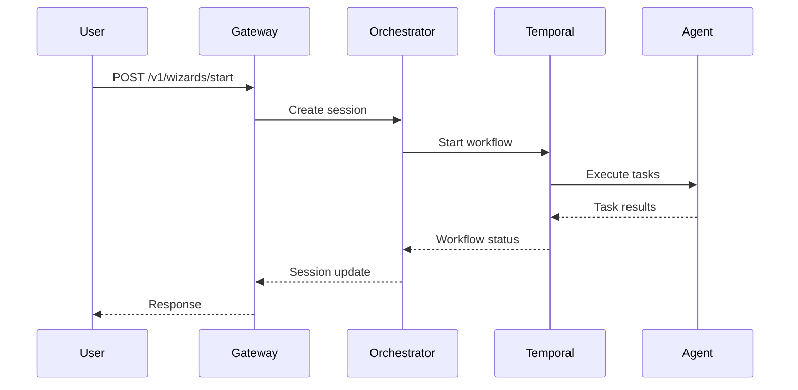

# Quick Start Tutorial


## Overview

This tutorial walks you through deploying SomaAgentHub locally and running your first agent workflow in under 10 minutes.

## Step 1: Deploy Local Cluster

```bash
# Clone the repository
git clone https://github.com/somatechlat/somaAgentHub.git
cd somaAgentHub

# Create and deploy to Kind cluster
make start-cluster
```

**What happens:**
- Creates Kind cluster `soma-agent-hub`
- Builds service images
- Deploys via Helm chart
- Sets up monitoring and observability

## Step 2: Verify Services

```bash
# Check pod status
kubectl get pods -n soma-agent-hub

# Expected output:
# NAME                              READY   STATUS    RESTARTS   AGE
# gateway-api-xxx                   1/1     Running   0          2m
# orchestrator-xxx                  1/1     Running   0          2m
# identity-service-xxx              1/1     Running   0          2m
# memory-gateway-xxx                1/1     Running   0          2m
# policy-engine-xxx                 1/1     Running   0          2m
```

## Step 3: Access Gateway API

```bash
# Port forward to local machine
make port-forward-gateway LOCAL=8080 REMOTE=10000
```

Gateway now available at: http://localhost:8080

## Step 4: Check Health Status

```bash
# Test health endpoint
curl http://localhost:8080/healthz

# Expected response:
# {
#   "status": "healthy",
#   "services": {
#     "redis": "connected",
#     "identity": "available",
#     "orchestrator": "available"
#   }
# }
```

## Step 5: List Available Wizards

```bash
# Get available wizard flows
curl http://localhost:8080/v1/wizards

# Expected response:
# {
#   "wizards": [
#     {
#       "id": "project-bootstrap",
#       "name": "Project Bootstrap Wizard",
#       "description": "Create and configure a new project"
#     }
#   ]
# }
```

## Step 6: Start a Wizard Session

```bash
# Start a new wizard session
curl -X POST http://localhost:8080/v1/wizards/start \
  -H "Content-Type: application/json" \
  -d '{
    "wizard_id": "project-bootstrap",
    "user_id": "tutorial-user"
  }'

# Response includes session_id:
# {
#   "session_id": "sess_abc123",
#   "status": "active",
#   "current_step": "project_details"
# }
```

## Step 7: Interact with Wizard

```bash
# Provide wizard input
curl -X POST http://localhost:8080/v1/wizards/sess_abc123/answer \
  -H "Content-Type: application/json" \
  -d '{
    "project_name": "my-first-project",
    "project_type": "web-app",
    "framework": "fastapi"
  }'

# Check session status
curl http://localhost:8080/v1/wizards/sess_abc123
```

## Step 8: Monitor Workflow Execution

```bash
# View orchestrator logs
kubectl logs -f -l app=orchestrator -n soma-agent-hub --tail=50

# View gateway logs
kubectl logs -f -l app=gateway-api -n soma-agent-hub --tail=50
```

## Step 9: Run Smoke Tests

```bash
# Validate full system functionality
make k8s-smoke
```

**Tests validate:**
- Service health endpoints
- Inter-service communication
- Workflow execution
- Memory and policy integration

## Understanding the Flow



## Next Steps

### Explore Features
- [Multi-Agent Orchestration](features/multi-agent-orchestration.md)
- [Memory & Context](features/intelligent-memory.md)
- [Policy & Governance](features/policy-governance.md)

### Development
- [Local Development Setup](../development-manual/local-setup.md)
- [API Reference](../development-manual/api-reference.md)

### Production
- [Deployment Guide](../technical-manual/deployment.md)
- [Monitoring Setup](../technical-manual/monitoring.md)

## Troubleshooting

### Services Not Starting
```bash
# Check pod events
kubectl describe pods -n soma-agent-hub

# Check service logs
kubectl logs -l app=gateway-api -n soma-agent-hub
```

### Port Forward Issues
```bash
# Kill existing port forwards
pkill -f "kubectl.*port-forward"

# Restart port forward
make port-forward-gateway LOCAL=8080 REMOTE=10000
```

### Temporal Connection
```bash
# Check Temporal server status
kubectl get pods -n soma-agent-hub | grep temporal

# Test Temporal connectivity from orchestrator
kubectl exec -it deployment/orchestrator -n soma-agent-hub -- \
  python -c "from temporal import Client; print('Connected')"
```